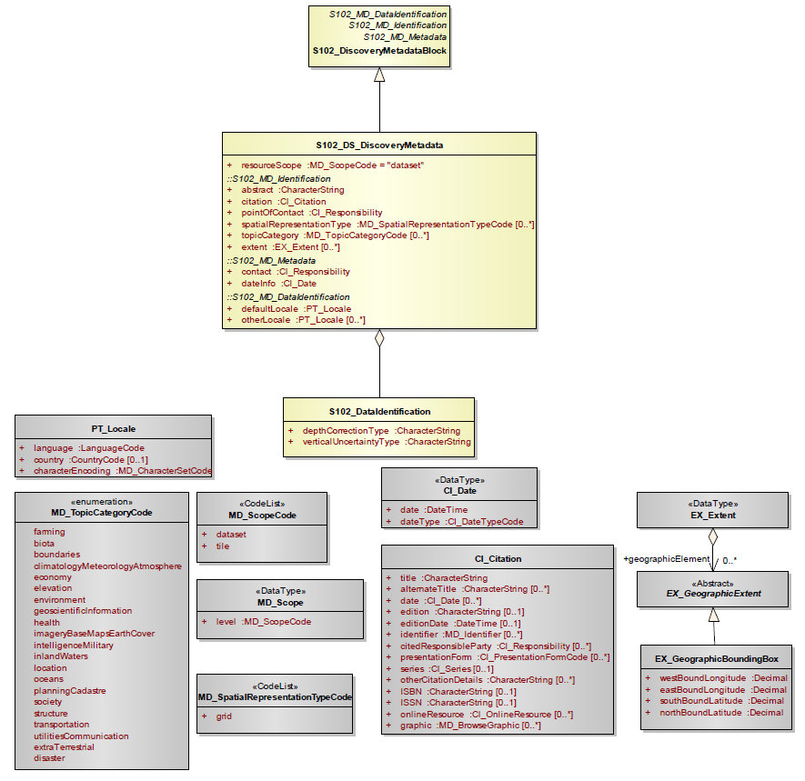
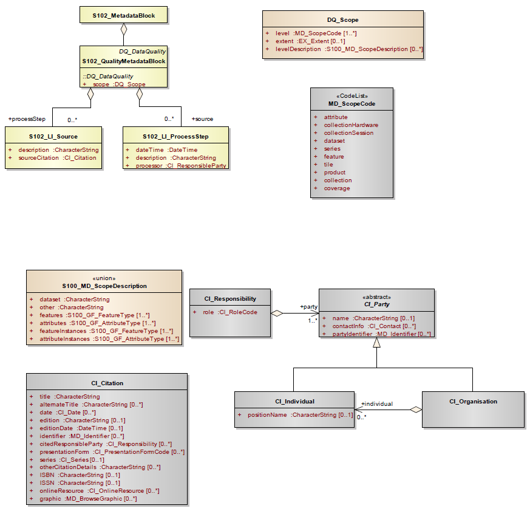
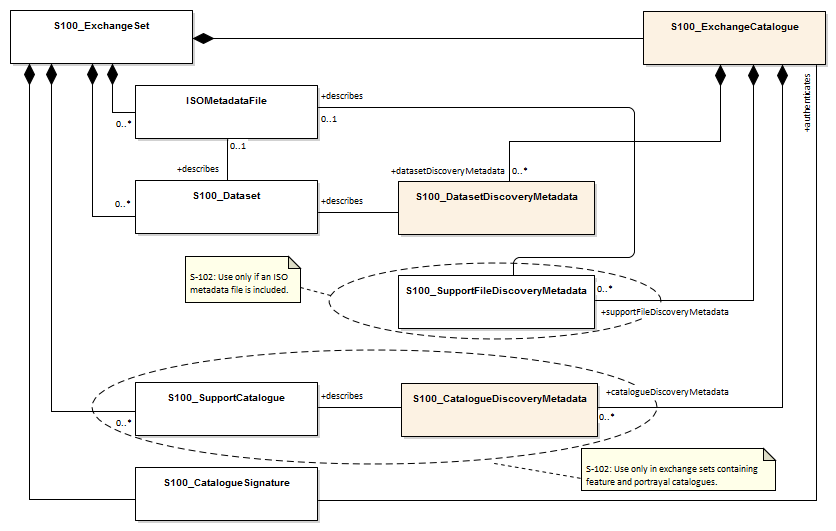
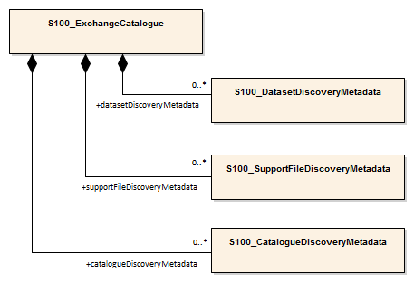

[[sec-metadata]]
== Metadata

//Since S-102 now describes a “navigation product” intended for ECDIS use: (a) ISO metadata files are not needed - ECDIS doesn’t have to read them; and (b) any “extra” metadata (metadata not defined in Part 17) should, at least in this edition, *not* be added to the exchange catalogue. If such extra metadata *has* to be provided, it should be as HDF5 attributes in the root group. (RM Comment 23Jan2023)

=== Introduction
The Metadata elements used in the Bathymetric Surface product are derived from S-100 and from <<iso-19115-1>> and <<iso-19115-2>>. Optionally additional metadata may be derived from <<iso-ts-19130>> and <<iso-ts-19130-2>> especially metadata relating to the sonar equipment which may have been used to acquire the bathymetric data.

S-102 metadata is encoded in two places:

* Metadata used for the discovery, identification, and use of S-102 datasets in S-100-based navigations systems (specifically, an S-100-capable ECDIS) is encoded in the exchange catalogue. This metadata conforms to S-100 Part 17, with product-specific restrictions added.

* Metadata required by the S-100 HDF5 encoding (<<iho-s100,part=10c>>) and product-specific metadata defined by this product specification are encoded at various levels in the HDF5 group hierarchy, as specified by <<iho-s100,part=10c>> or <<subsec-product-structure>>.

//Recommend either:
//(a) deletion of <<subsec-discovery-metadata>> and <<subsec-structure-metadata>>  along with Table 15 “S-102 Handling of Core Metadata Elements”, and try to encode any of their contents that are absolutely //essential described in the NOTE below;
//
//OR
//
//(b) Combine Table 15 and <<subsec-discovery-metadata>> and <<subsec-structure-metadata>> into a new clause (“Metadata in ISO format”) and make it clear that this is encoded as ISO-format metadata in a //separate ISO metadata file. (NB: ECDIS isn’t required to process this ISO metadata file - at most it would be displayed to the mariner as if it were any other XML //support file.)
//
//CATALOG.XML should conform to S-100 Part 17 with product-specific restrictions only (no extensions).
//
//NOTE: S-102 PT should review Table and <<subsec-discovery-metadata>> and <<subsec-structure-metadata>>  and determine which of their metadata *must* be //included in S-102. Then add attributes (or datasets) to the root group, feature container group, or feature instance groups to encode that metadata, depending on //whether it applies to all features, to a feature type, or feature instance. (Given that S-102 2.2 has only 2 feature types, it should probably be the root group, //meaning it applies to all feature types and instances.)

//Above comments from RM circa 23Jan2023

<<tab-s102-handling-of-core-metadata-elements>> outlines the core metadata elements (mandatory and recommended optional) required for describing a geographic information data set. The codes indicate: "M" mandatory, "O" optional, and "C" conditional as defined in <<iso-19115-1>>. <<tab-s102-handling-of-core-metadata-elements>> indicates how the mandatory, optional, and conditional core metadata are handled in S-102.

[[tab-s102-handling-of-core-metadata-elements]]
.S-102 Handling of Core Metadata Elements
[cols="a,a"]
|===

|*Dataset title (M)*
|*Spatial representation type (O)*

|S102_DS_DiscoveryMetadata > citation > CI_Citation.title +
from: (MD_Metadata.identificationInfo > MD_DataIdentification.citation > CI_Citation.title)
|S102_DS_DiscoveryMetadata > spatialRepresentationType: MD_ DataIdentification. spatialRepresentationType +
002 -- Grid; (for regular grid coverage) +
from: (MD_Metadata.identificationInfo > MD_DataIdentification.spatialRepresentationType)

|*Dataset reference date (M)* +
S102_DS_DiscoveryMetadata > citation > CI_Citation.date +
from: (MD_Metadata.identificationInfo > MD_DataIdentification.citation > CI_Citation.date)

|*Reference system (O)* +
S102_StructureMetadataBlock > hRefSystem +
and +
S102_StructureMetadataBlock > vRefSystem +
from: (MD_Metadata.referenceSystemInfo > MD_ReferenceSystem.referenceSystemIdentifier > RS_Identifier)

|*Resource point of contact (O)* +
S102_DS_DiscoveryMetadata > pointOfContact > CI_Responsiblity +
from: (MD_Metadata.identificationInfo > MD_DataIdentification.pointOfContact > CI_Responsiblity)

|*Lineage (O)* +
S102_QualityMetadataBlock > S102_LI_Source +
and +
S102_QualityMetadataBlock > S102_LI_ProcessStep +
from: (MD_Metadata.resourceLineage > > LI_Lineage)

|*Geographic location of the dataset (by four coordinates or by geographic identifier) \(C)* +
S102_DS_DiscoveryMetadata > extent > EX_Extent +
from: (MD_Metadata.identificationInfo > MD_identification.extent > EX_Extent > EX_GeographicBoundingBox +
or +
EX_GeographicDescription)

|*On-line link to resource (O)* +
(MD_Metadata.distributionInfo > MD_Distribution > MD_DigitalTransferOption.onLine > CI_OnlineResource) +
Optional - not required

|*Dataset language (M)* +
S102_DS_DiscoveryMetadata > language +
from: (MD_Metadata.identificationInfo > MD_DataIdentification.language) +
|*Metadata file parent identifier \(C)* +
(MD_Metadata.parentMetadata > CI_Citation.identifier) +
Implicit in S-102 product specification reference to
<<iso-19115-1>> as a normative reference

|*Dataset character set \(C)* +
set to default = "utf8". [not required when set to default from <<iso-19115-1>>] +
from: (MD_Metadata.identificationInfo > MD_DataIdentification.defaultLocale > PT_Locale.characterEncoding)

|*Metadata standard name (O)* +
(MD_Metadata.metadataStandard > CI_Citation.title) +
Implicit in S-102 product specification reference to <<iso-19115-1>> as a normative reference

|*Dataset topic category (M)* +
S102_DS_DiscoveryMetadata > topicCategory: +
MD_TopicCategoryCode +
* 006 -- elevation; +
* 014 -- oceans; +
* 012 -- inlandWaters +

From: (MD_Metadata.identificationInfo > MD_Identification.topicCategory)

|*Metadata standard version (O)* +
(MD_Metadata.metadataStandardVersion) +
Implicit in S-102 product specification reference to <<iso-19115-1>> as a normative reference

|*Spatial resolution of the dataset (O)* +
(MD_Metadata.identificationInfo > MD_DataIdentification.spatialResolution > MD_Resolution.equivalentScale +
or +
MD_Resolution.distance) +
Since this data set is a grid coverage resolution is defined by the coverage grid parameters

|*Metadata language \(C)* +
(MD_Metadata. defaultLocale > PT_Locale.language) +
The language is set to English. In addition, additional languages may be used in accordance with the structure for handling multi-languages per <<iso-19115-1>>

|*Abstract describing the dataset (M)* +
S102_DS_DiscoveryMetadata > abstract +
from: (MD_Metadata.identificationInfo > MD_DataIdentification.abstract)

|*Metadata character set \(C)* +
set to default = "utf8". [not required when set to default from <<iso-19115-1>>] +
from: (MD_Metadata. defaultLocale > PT_Locale.characterEncoding)

|*Distribution format (O)* +
(MD_Metadata.distributionInfo > MD_Distribution > MD_Format) +
Optional - not applicable +
To maintain the separation of carrier and content the content model does not contain any format information. This would be included in a transmittal or by file types. +

|*Party responsible for the metadata information (M)* +

S102_DS_DiscoveryMetadata > contact +

from: (MD_Metadata.contact > CI_Responsibility.CI_Individual +
or +
MD_Metadata.contact > CI_Responsibility.CI_Organisation)

|*Temporal extent information for the dataset (O)* +

(MD_Metadata.identificationInfo > MD_Identification.extent > EX_Extent.temporalElement

|*Date(s) associated with the metadata (M)* +

S102_DS_DiscoveryMetadata > dateInfo +

from: (MD_Metadata.dateInfo > CI_Date)

|*Vertical extent information for the dataset (O)* +

MD_Metadata.identificationInfo > MD_DataIdentification.extent > EX_Extent.verticalElement > EX_VerticalExtent

|*Name of the scope/type of resource for which the metadata is provided (M)* +

S102_DS_DiscoveryMetadata > resourceScope +

from: (MD_Metadata.metadataScope > MD_MetadataScope.resourceScope > MD_ScopeCode (codelist -- <<iso-19115-1>>))

|===

The dataset metadata is stored in a separate file encoded according to the ISO 19115X Schemas. The name of the metadata file is MD_<HDF5 data file base name>.XML (or .xml) ISO metadata (per <<iho-s100,part=10c,clause=10c-12>>). The root element in the file is *S102_DSMetadataBlock* which contains *S102_DS_DiscoveryMetadata*, *S102_StructureMetadataBlock* and *S102_QualityMetadataBlock*.

[[subsec-discovery-metadata]]
=== Discovery metadata
Metadata is used for a number of purposes. One high level purpose is for the identification and discovery of data. Every data set needs to be identified so that it can be distinguished from other data sets and so it can be found in a data catalogue, such as a Web Catalogue Service. The discovery metadata applies at the *S102_DataSet* level. Metadata in *S102_DiscoveryMetadataBlock* is encoded within a separate metadata xml file under the [[metab]]*S102_DSMetadataBlock* root element.

[[fig-s102-discovery-metadata]]
.S-102 Discovery Metadata

<<fig-s102-discovery-metadata>> above shows the *S102_DiscoveryMetadataBlock*. It has one subtype S102_DS_DiscoveryMetadata. This implements the metadata classes from <<iso-19115-1>>. First implementation classes have been developed corresponding to each of the <<iso-19115-1>> classes that have been referenced in which only the applicable attributes have been included. The class *S102_DS_DiscoveryMetadata* inherits attributes from S-102 specific implementation classes. In addition, an additional component *S102_DataIdentification* has been added.

This model provides the minimum amount of metadata for a Bathymetry Surface data product. Any of the additional optional metadata elements from the source <<iso-19115-1>> metadata standard can also be included.

<<tab-discoverymetadablock-class-attributes>> provides a description of each attribute of the S102_DiscoveryMetadataBlock class attributes.

[[tab-discoverymetadablock-class-attributes]]
.S102_DiscoveryMetadataBlock class attributes
[cols="a,a,a,^a,a,a",options="header",cols="1,3,2,1,3,3"]
|===
|Role Name |Name |Description |Mult |Type |Remarks

|Class
|S102_DiscoveryMetadata Block
|Container class for discovery metadata
|-
|-
|

|Class
|S102_DS_DiscoveryMeta data
|Container class for discovery metadata related to an entire data set
|-
|-
|

|attribute
|resourceScope
|
|1
|MD_ScopeCode
|"dataset" for S102_DS_DiscoveryMetadata

|attribute
|abstract
|Brief narrative summary of the content of the resource(s)
|1
|CharacterString
|

|attribute
|citation
|Citation data for the resource(s)
|1
|CI_Citation
|CI_Citation \<<DataType>>

Required items are Citation.title, & Citation.date,

|attribute
|pointOfContact
|Identification of, and means of communication with, person(s) and organization(s) associated with the resource(s)
|1
|CI_Responsibility
|See <<iho-s100,part=4a,table=4a-2>> and <<iho-s100,part=4a,table=4a-3>> for required items

|attribute
|spatialRepresentationType
|Method used to spatially represent geographic information
|1
|MD_SpatialRepresentationType Code a|MD_SpatialRepresentationType Code \<<CodeList>>

002 -- Grid; (for regular grid coverage)
001 -- Vector; (not used)

|attribute
|topicCategory
|Main theme(s) of the dataset
|1..*
|MD_TopicCategoryCode
|MD_TopicCategoryCode +
\<<Enumeration>> +
006 -- elevation +
014 -- oceans +
012 -- inlandWaters

|attribute
|extent
|Extent information including the bounding box, bounding polygon, vertical, and temporal extent of the dataset
|0..1
|EX_Extent
|EX_Extent \<<DataType>>

If this attribute is present, the four bounding box sub-attributes westBoundLongitude, etc., must be populated

|attribute
|contact
|Organisation responsible for the metadata information
|1
|CI_Responsibility>CI_Organisation
|See <<iho-s100,part=4a,table=4a-2>> and <<iho-s100,part=4a,table=4a-3>> for required items

|attribute
|dateInfo
|Date that the metadata was created
|1
|CI_Date +
(dateInfo.dateType = 'creation')
|

|attribute
|defaultLocale
|Default language and character set used in the exchange catalogue
|1
|PT_Locale +
(defaultLocale.language = ISO 639-2/T code) a|Populate 'language' from ISO 639-2/T list of languages, default "`eng`".

For example: defaultLocale.language="eng" for English
defaultLocale.language="fra" for French

|attribute
|otherLocale
|Other languages and character sets used in the exchange catalogue |0..*
|PT_Locale +
(otherLocale.language = ISO 639-2/T code)
|Populate 'language' from ISO 639-2/T list of languages.

otherLocale need be populated only if the dataset uses more than one language

|Class
|S102_DataIdentification
|Component for S102_DiscoveryMeta data Block. Extension beyond <<iso-19115-1>> metadata
|-
|-
|

|attribute
|depthCorrectionType
|Code defining the type of sound velocity correction made to the depths
|1
|CharacterString
|see <<tab-code-defining-the-type-of-sound-velocity-correction>>

|attribute
|verticalUncertaintyType
|Code defining how uncertainty was determined
|1
|CharacterString
|see <<tab-code-defining-how-uncertainty-was-determined>>

|===

The class *S102_DataIdentification* provides an extension to the metadata available from <<iso-19115-1>>. The verticalUncertaintyType attribute was added to accurately describe the source and meaning of the encoded Uncertainty coverage. The depthCorrectionType was also added to define if and how the depths are corrected (that is, true depth, depth ref 1500 m/sec, etc.). <<tab-code-defining-the-type-of-sound-velocity-correction>> and <<tab-code-defining-how-uncertainty-was-determined>> provide a description.

[[tab-code-defining-the-type-of-sound-velocity-correction]]
.Code defining the type of sound velocity correction
[cols="a,a",options="header"]
|===
|Value |Definition

|SVP_Applied |Sound velocity field measured and applied (True Depth)
|1500_MS |Assumed sound velocity of 1500 m/s used
|1463_MS |Assumed sound velocity of 1463 m/s used (Equivalent to 4800 ft./s)
|NA |Depth not measured acoustically
|Carters |Depths corrected using Carter's Tables
|Unknown |

|===

NOTE: As stated in <<itd>>, uncertainty is always considered to be 1-dimensional and at the 2-sigma or 95% confidence level.

[[tab-code-defining-how-uncertainty-was-determined]]
.Code defining how uncertainty was determined
[cols="a,a",option="header"]
|===
|Value |Definition

|Unknown |"Unknown" - The uncertainty layer is an unknown type
|Raw_Std_Dev |"Raw Standard Deviation" - Raw standard deviation of soundings that contributed to the node
|CUBE_Std_Dev |Dev "CUBE Standard Deviation" - Standard deviation of soundings captured by a CUBE hypothesis (that is, CUBE's standard output of uncertainty)
|Product_Uncert |"Product Uncertainty" - The greater of 1) standard deviation of the soundings contributing to the depth solution, or 2) the _a priori_ computed uncertainty estimate (that is, modelled Total Vertical Uncertainty)
|Historical_Std_Dev |"Historical Standard Deviation" -- Estimated standard deviation based on historical/archive data

|===

[[subsec-structure-metadata]]
=== Structure metadata
Structure metadata is used to describe the structure of an instance of a collection. Since constraints can be different on separate files (for example they could be derived from different legal sources), or security constraints may be different, the constraint information becomes part of the structure metadata. The other structure metadata is the grid representation and the reference system.

<<fig-s102-structure-metadata>> shows the *S102_StructureMetadataBlock*. The metadata block is generated by the inheritance of attributes from a number of <<iso-19115-1>> metadata classes and from two implementation classes for the horizontal and vertical reference system. This makes the metadata block a simple table.

Metadata in *S102_StructureMetadataBlock* is encoded within a separate metadata xml file under the *S102_MetadataBlock* root element.

[[fig-s102-structure-metadata]]
.S-102 Structure Metadata
image::../images/figure-s102-structure-metadata.png[]

[[tab-structuremetadatablock-class-attributes]]
.S102_StructureMetadataBlock class attributes
[cols="1,3,2,1,2,2"]
|===
h|Role Name h|Name h|Description h|Mult h|Type h|Remarks

|Class |S102_StructureMetadata Block |Container class for structure metadata ^|- |- |

|attribute |maximumDisplayScale |Maximum display scale for the bathymetry coverage ^|1 |Integer |

|attribute |minimumDisplayScale |Minimum display scale for the bathymetry coverage ^|1 |Integer |

|attribute |numberOfDimensions |Number of independent spatial/temporal axes ^|1 |Integer a|Default = 2

No other value is allowed

|attribute |axisDimensionProperties |Information about spatial- temporal axis properties ^|1 |MD_Dimension |MD_Dimension \<<DataType>> dimensionName and dimensionSize

|attribute |cellGeometry |Identification of grid data as point or cell ^|1 |MD_CellGeomet ryCode |

|attribute |transformationParameterA vailability |Indication of whether or not parameters for transformation between image coordinates and geographic or map coordinates exist (are available) ^|1 |Boolean a|1 = yes +
0 = no +
Mandatory and must be 1.

|attribute |vRefSystem |Name of vertical reference system ^|1 |MD_Identifier > code, codespace, version |Must be the identifier of a vertical reference system

|attribute |hRefSystem |Name of horizontal reference system ^|1 |MD_Identifier > code, codespace, version |Must be the identifier of a vertical reference system from <<tab-s102-coordinate-reference-systems-epsg-codes>> -- EPSG Codes

|attribute |accessConstraints |Access constraints applied to assure the protection of privacy or intellectual property,and any special restrictions or limitations on obtaining the dataset ^|0..* |MD_Restriction Code |

|attribute |useConstraints |Constraints applied to assure the protection of privacy or intellectual property, and any special restrictions or limitations or warnings on using the dataset ^|0..* |MD_Restriction Code |

|attribute |otherConstraints |Other restrictions and legal prerequisites for accessing and using the dataset ^|0..* |CharacterString |

|attribute |classification |Name of the handling restrictions on the dataset ^|1 |MD_Classificatio nCode |

|attribute |userNote |Additional information about the classification ^|0-1 |CharacterString |

|attribute |classificationSystem |Name of the classification system ^|0..1 |CharacterString |

|attribute |handlingDescription |Additional information about the restrictions on handling the dataset ^|0..1 |CharacterString |

|Class |MD_Dimension |Axis properties ^|- |- |

|attribute |dimensionName |Name of axis ^|1 |MD_DimensionTypeCode |Defaults are "row" and "column". No other value is allowed

|attribute |dimensionSize |Number of elements along the axis ^|1 |Integer |

|attribute |resolution |Degree of detail in the grid dataset ^|0..1 |Measure |value = number

//<<iho-s100,part=17>> has "approximateGridResolution" (RM comment 23Jan2023)

|===

==== Quality metadata
Quality metadata is used to describe the quality of the data in an instance of a collection. <<fig-s102-quality-metadata>> shows the *S102_QualityMetadataBlock*. The *S102_QualityMetadataBlock* derives directly from the <<iso-19115-1>> class *DQ_DataQuality*. However, its components *S102_LI_Source* and *S102_LI_ProcessStep* are generated by the inheritance of attributes from the <<iso-19115-1>> classes *LI_Scope* and *LI_ProcessStep*. Only some of the attributes of the referenced <<iso-19115-1>> classes are implemented.

Metadata in *S102_QualityMetadataBlock* is encoded within a separate metadata xml file under the *S102_MetadataBlock* root element.

[[fig-s102-quality-metadata]]
.S-102 Quality Metadata

<<tab-quality-metadata-block-description>> provides a description of each attribute of the S102_QualityMetadataBlock class attributes and those of its components.

[[tab-quality-metadata-block-description]]
.Quality Metadata Block description
[cols="a,a,a,^a,a,a",options="header"]
|===
|Role Name |Name |Description |Mult |Type |Remarks

|Class
|S102_QualityMetadataBlock
|Container class for quality metadata
|-
|-
|

|attribute
|scope
|Extent of characteristic(s) of the data for which quality information is reported
|1
|DQ_Scope
|

|Class
|S102_LI_Source
|Information about the source data used in creating the data specified by the scope
|-
|-
|

|attribute
|description
|Detailed description of the level of the source data
|1
|CharacterString
|

|attribute
|sourceCitation
|Recommended reference to be used for the source data
|1
|CI_Citation
|Required items are citation.title and citation.date

|Class
|S102_LI_ProcessStep
|Information about an event or transformation in the life of a dataset including the process used to maintain the dataset
|-
|-
|

|attribute
|dateTime
|Date and time or range of date and time on or over which the process step occurred
|1
|CharacterString
|

|attribute
|description
|Description of the event, including related parameters or tolerances |1
|CharacterString
|

|attribute
|processor
|Identification of, and means of communication with, person(s) and organization(s) associated with the process step
|1
|CI_Responsibility
|See <<iho-s100,part=4a,table=4a-2>> and <<iho-s100,part=4a,table=4a-3>> for required items

|Class
|DQ_Scope
|Container class for quality metadata
|-
|-
|

|attribute
|level
|Hierarchical level of the data specified by the scope
|0..*
|MD_ScopeCode \<<CodeList>>
|[[dataset]]"dataset"

|attribute
|extent
|Information about the horizontal, vertical and temporal extent of the data specified by the scope
|0..*
|EX_Extent \<<DataType>>
|Used only if the extent of the data is different from the EX_Extent given for the collection / tile

|attribute
|levelDescription
|Detailed description about the level of the data specified by the scope
|1
|MD_ScopeDescription \<<Union>>
|
|===

==== Acquisition metadata
Acquisition metadata to a Bathymetric Surface Product Specification profile is being developed nationally. The classes derive from <<iso-19115-1>>, <<iso-19115-2>>, <<iso-ts-19130>>, and <<iso-ts-19130-2>>. The later document <<iso-ts-19130-2>> contains description of sonar parameters.

[[subsec-exchange-set-metadata]]
=== Exchange Set metadata
For information exchange, there are several categories of metadata required: metadata about the overall Exchange Catalogue, metadata about each of the datasets contained in the Catalogue.

//<<subsec-exchange-set-metadata>> mixed exchange set structure with metadata, as does <<iho-s100,part=17>>, as did the old Part 4a in previous editions of S-100. Exchange set structure and metadata are different topics and the structure of the exchange set fits better as a new sub-clause of Clause 11 (Data Product Delivery) than it does under Clause 12 (Metadata) (or in a new top-level clause). Exchange set structure is now described in a new sub-clause of clause 11 and the diagram “realization of the exchange set classes” below is recommended for deletion. (RM comment 25Jan2023)

<<fig-components-and-associated-metadata-for-the-s102-exchange-set>> depicts the relationships of exchange set elements (datasets and feature/portrayal catalogues) and exchange set metadata. This figure is derived from Figure 17-2 in S-100 Edition 5.0.0 with relationships not applicable to S-102 omitted.

//We need to correct the S-100 reference to a proper one. (LH comment 7Feb2023)

<<fig-relationship-between-exchange-catalogue-discovery-metadata-and-dataset>> depicts the structure of the exchange catalogue and its component discovery metadata blocks. The structure is the same as in <<iho-s100,part=17>>.

More detailed information about the various classes is shown in in <<fig-s102-exchange-set-class-details>> and a textual description in <<tab-s102-exchangeCatalogue-params;to!tab-pt-locale-params>>.

The discovery metadata classes have numerous attributes which enable important information about the datasets to be examined without the need to process the data, for example, decrypt, decompress, load, etc. Other Catalogues can be included in the Exchange Set in support of the datasets such as Feature and Portrayal.

[[fig-components-and-associated-metadata-for-the-s102-exchange-set]]
.Components and associated metadata for the S-102 exchange set (S-100 5.0.0 Figure 17-2 with items not used by S-102 omitted)

[[fig-relationship-between-exchange-catalogue-discovery-metadata-and-dataset]]
.Relationship between exchange catalogue, discovery metadata, and dataset (from S-100 5.0.0 Figure 17-6)

[%landscape]
<<<
[[fig-s102-exchange-set-class-details]]
.S-102 Exchange Set Class Details
image::../images/figure-s102-exchange-set-class-details.png[]

//<<fig-s102-exchange-set-class-details>> should be on a landscape mode page (RM comment 25Jan2023)

[%portrait]
<<<

The following clauses define the mandatory and optional metadata needed for S-102. In some cases, the metadata may be repeated in a national language. If this is the case it is noted in the Remarks column.

The XML schemas for S-102 exchange catalogues will be available from the IHO Geospatial Information (GI) Registry and/or the S-100 GitHub site (https://github.com/IHO-S100WG).

The S-102 exchange catalogue uses the S-100 exchange catalogue schemas which are available from the S-100 schema server at https://schemas.s100dev.net (downloadable archives are also available on the site for offline use). Implementation of the S-102-specific constraints described in clauses 12.X to 12.Y below is left to developer decision as it can be done in various ways depending on implementation frameworks and the requirements of production or application software.

=== Language

The exchange language must be English.

Character strings must be encoded using the character set defined in <<iso-10646-1>>, in Unicode Transformation Format-8 (UTF-8). A BOM (byte order mark) must not be used.

[%landscape]
<<<

[[subsec-s102_exchangecatalogue]]
=== S102_ExchangeCatalogue

Each Exchange Set has a single S100_ExchangeCatalogue which contains meta information for the data in the Exchange Set.

S-102 uses S100_ExchangeCatalogue without extension. S-102 restricts certain attributes and roles as described in <<tab-s102-exchangeCatalogue-params>>. These restrictions are in bold type and noted in the Remarks column.

[[tab-s102-exchangeCatalogue-params]]
.S102_ExchangeCatalogue parameters
[cols="a,a,a,^a,a,a",options="header"]
|===
|Role name |Name |Description |Mult |Type |Remarks

|Class
|S100_ExchangeCatalogue
|An exchange catalogue contains the discovery metadata about the exchange datasets and support files
|-
|-
|Support file discovery metadata is not permitted because S-102 does not use support files
//Review above after PT decision about ISO metadata files (RM comment 25Jan2023)

|Attribute
|identifier
|Uniquely identifies this Exchange Catalogue
|1
|S100_ExchangeCatalogueIdentifier
|*Mandatory in S-102*

|Attribute
|contact
|Details about the issuer of this Exchange Catalogue
|1
|S100_CataloguePointOfContact
|*Mandatory in S-102*

|Attribute
|productSpecification
|Details about the Product Specifications used for the datasets contained in the Exchange Catalogue
|0..*
|S100_ProductSpecification
|

|Attribute
|defaultLocale
|Default language and character set used for all metadata records in this Exchange Catalogue
|0..1
|PT_Locale
|Default is English and UTF-8

|Attribute
|otherLocale
|Other languages and character sets used for the localized metadata records in this Exchange Catalogue
|0..*
|PT_Locale
|Required if any localized entries are present in the Exchange Catalogue

|Attribute
|exchangeCatalogueDescription
|Description of what the Exchange Catalogue contains
|0..1
|CharacterString
|

|Attribute
|exchangeCatalogueComment
|Any additional information
|0..1
|CharacterString
|

|Attribute
|certificates
|Signed public key certificates referred to by digital signatures in the Exchange Set
|0..*
|S100_SE_CertificateContainer
|Content defined in <<iho-s100,part=15>>. +
All certificates used, except the SA root certificate (installed separately by the implementing system) shall be included.

|Attribute
|dataServerIdentifier
|Identifies the data server for the permit
|0..1
|CharacterString
|

|Role
|datasetDiscoveryMetadata|Exchange catalogues may include or reference discovery metadata for the datasets in the Exchange Set
|0..*
|Aggregation +
S100_DatasetDiscoveryMetadata
|

|Role
|catalogueDiscoveryMetadata
|Metadata for catalogue
|0..*
|Aggregation +
S100_CatalogueDiscoveryMetadata
|Metadata for the feature, portrayal, and interoperability catalogues, if any

|Role
|supportFileDiscoveryMetadata
//Review after PT decision about ISO metadata files (RM comment 26Jan2023)
|Exchange Catalogues may include or reference discovery metadta for the support files in the Exchange Set
|0..*
|Aggregation +
S100_SupportFileDiscoveryMetadata
|*The only permitted support files in S-102 are ISO metadata files.
|===

==== S100_ExchangeCatalogueIdentifier
S-102 uses S100_ExchangeCatalogueIdentifier without modification.

[[tab-s100-exchangeCatalogueIdentifier-params]]
.S100_ExchangeCatalogueIdentifier parameters
[cols="a,a,a,^a,a,a",options="header"]
|===
|Role name |Name |Description |Mult |Type |Remarks

|Class
|S100_ExchangeCatalogueIdentifier
|An identifier for an Exchange Catalogue
|-
|-
|The concatenation of identifier, edition number, and dateTime for the unique name.

|Attribute
|identifier
|Uniquely identifies this Exchange Catalogue
|1
|CharacterString
| (Rules, if any, for S-102 identifiers are TBD.)

|Attribute
|dateTime
|Creation date and time of the Exchange Catalogue, including time zone
|1
|DateTime
|Format: yyyy-mm-ddThh:mm:ssZ
|===

==== S100_CataloguePointOfContact
S-102 uses S100_CataloguePointOfContact without modification.

[[tab-s100-cataloguePointContact-params]]
.S100_CataloguePointOfContact parameters
[cols="a,a,a,^a,a,a",options="header"]
|===
|Role name |Name |Description |Mult |Type |Remarks

|Class
|S100_CataloguePointOfContact
|Contact details of the issuer of this Exchange Catalogue
|-
|-
|-

|Attribute
|organization
|The organization distributing this Exchange Catalogue
|1
|CharacterString
|This could be an individual producer, value added reseller, etc.

|Attribute
|phone
|The phone number of the organization
|0..1
|CI_Telephone
|

|Attribute
|address
|The address of the organization
|0..1
|CI_Address
|
|===

=== S100_DatasetDiscoveryMetadata
Dataset discovery metadata in S-102 restricts certain attributes and roles as described in <<tab-s100-datasetDiscoveryMetadata-params>>. Optional S-100 attributes which are mandatory in S-102 are indicated in the Remarks column.

[[tab-s100-datasetDiscoveryMetadata-params]]
.S100_DatasetDiscoveryMetadata parameters
[cols="a,a,a,^a,a,a",options="header"]
|===
|Role name |Name |Description |Mult |Type |Remarks

|Class
|S100_DatasetDiscoveryMetadata
//Review after decision about ISO metadata files (RM comment 25Jan2023)
|Metadata about the individual datasets in the Exchange Catalogue
|-
|-
|The optional S-100 attributes updateApplicationNubmer, updateApplicationDate, referenceID, and temporalExtent are not used in S-102. +
References to support file discovery metadata are not permitted because S-102 does not use support files.

|Attribute
|fileName
|Dataset file name
|1
|URI
|Format: file:/S-102/DATASET_FILES/<dsname> +
Dataset file name <dsname> must be according to format defined in <<subsec-dataset-file-naming>>.

|Attribute
|description
|Short description giving the area or location covered by the dataset
|0..1
|CharacterString
|For example a harbour or port name, between two named locations, etc.

|Attribute
|datasetID
|Dataset ID expressed as a Maritimefootnote:[S-100 5.0.0 uses an incorrect term: "*Marine* Resource Name".] Resource Name
|0..1
//listed as 0..1 in Ed. 5, but make it mandatory in S-102? (RM comment 26Jan2023)
|URN
|The URN must be an MRN. +
MRN construction rules will be defined by the IHO.

|Attribute
|compressionFlag
|Indicates if the resource is compressed
|1
|Boolean
|_True_ indicates a compressed dataset resource. +
_False_ indicates an uncompressed dataset resource.

|Attribute
|dataProtection
|Indicates if the data is encrypted
|1
|Boolean
|_True_ indicates an encrypted dataset resource. +
_False_ indicates an unencrypted dataset resource.

|Attribute
|protectionScheme
|Specification of method used for data protection
|0..1
|S100_ProtectionScheme
|*Populate if and only if dataProtection = _True_.*

|Attribute
|digitalSignatureReference
|Specifies the algorithm used to compute digitalSignatureValue
|0..1
|S100_SE_DigitalSignatureReference (see <<iho-s100,part=15>>)
|

|Attribute
|digitalSignatureValue
|Value derived from the digital signature
|1..*
|S100_SE_DigitalSignatureValue (see <<iho-s100,part=15>>)
|The value resulting from application of digitalSignatureReference +
Implemented as the digital signature format specified in <<iho-s100,part=15>>

|Attribute
|copyright
|Indicates if the dataset is copyrighted
|1
|Boolean
|_True_ indicates the resource is copyrighted. +
_False_ indicates the resource is not copyrighted.

|Attribute
|classification
|Indicates the security classification of the dataset
|0..1
|Class +
MD_SecurityConstraints>MD_ClassificationCode (codelist)
|[loweralpha]
. unclassified
. restricted
. confidential
. secret
. top secret
. sensitive but unclassified
. for official use only
. protected
. limited distribution

|Attribute
|purpose
|The purpose for which the dataset has been issued
|1
|S100_Purpose
|*Mandatory in S-102*

|Attribute
|notForNavigation
|Indicates the dataset is not intended to be used for navigation
|1
|Boolean
|_True_ indicates the dataset *is not* intended to be used for navigation. +
_False_ indicates the dataset *is* intended to be used for navigation.

|Attribute
|specificUsage
|The use for which the dataset is intended
|0..1
|MD_USAGE>specificUsage (character string)
|

|Attribute
|editionNumber
|The edition number of the dataset
|1
|Integer
|When a data set is initially created, the Edition number 1 is assigned to it. The Edition number is increased by 1 at each new Edition. Edition number remains the same for a re-issue. +
*Mandatory in S-102*

|Attribute
|issueDate
|Date on which the data was made available by the Data Producer
|1
|Date
|

|Attribute
|issueTime
|Time of day at which the data was made available by the Data Producer
|0..1
|Time
|The S-100 datatype Time

|Attribute
|boundingBox
|The extent of the datast limits
|1
|EX_GeographicBoundingBox
|*Mandatory in S-102*

|Attribute
|productSpecification
|The Product Specification used to create this dataset
|1
|S100_ProductSpecification
|

|Attribute
|producingAgency
|Agency responsible for producing the data
|1
|CI_Responsibility>CI_Organisation
|See <<iho-s100,part=17,table=17-3>>

|Attribute
|producerCode
|The official IHO Producer Code from S-62
|0..1
|CharacterString
|

|Attribute
|encodingFormat
|The encoding format of the dataset
|1
|S100_EncodingFormat
|*The only allowed value is HDF5*

|Attribute
|dataCoverage
|Provides information about data coverages within the dataset
|1..*
|S100_DataCoverage
|*This optional S-100 attribute is mandatory in S-102*

|Attribute
|comment
|Any additional information
|0..1
|CharacterString
|

|Attribute
|defaultLocale
|Default language and character set used in the dataset
|0..1
|PT_Locale
|In absence of defaultLocale, the language is English, and the character set is UTF-8.

|Attribute
|otherLocale
|Other languages and character sets used in the dataset
|0..*
|PT_Locale
|

|Attribute
|metadataPointOfContact
|Point of contact for metadata
|0..1
|CI_Responsibility>CI_Individual +
or +
CI_Responsibility>CI_Organisation
|Only if metadataPointOfContact differs from producingAgency

|Attribute
|metadataDateStamp
|Date stamp for metadata
|0..1
|Date
|May or may not be the issue date

|Attribute
|replacedData
//Earlier comment from PT11 in change guide states: "Add, 'Not used in S-102'. For service management, RENCs and service providers will need to use this attribute to manage coverage changes."
//If not used, this row should be deleted and the remark in 'Classname' row updated. Does the PT11 comment mean it is needed after all? (RM Metacomment 24Jan2023)
|If a data file is cancelled, it is replaced by another data file.
|0..1
|Boolean
|

|Attribute
|dataReplacement
//Earlier comment from PT11 in change guide states: "Add, 'Not used in S-102'. For service management, RENCs and service providers will need to use this attribute to manage coverage changes."
//If not used, this row should be deleted and the remark in 'Classname' row updated. Does the PT11 comment mean it is needed after all? (RM Metacomment 24Jan2023)
|Cell name
|0..*
|CharacterString
|A dataset may be replaced by 1 or more datasets.

|Attribute
|navigationPurpose
|Classification of intended navigation purpose (for Catalogue indexing purposes)
|1..3
|S100_NavigationPurpose
|If Product Specification is intended for creation of navigational products, this attribute should be mandatory. +
*Mandatory in S-102*

|Role
|resourceMaintenance
//TBD whether S-102 actually needs resource maintenance information even in the case described by the added paragraph in the Remarks column. (RM comment 24Jan2023)
|Information about the frequency and scope of resource updates
|0..1
|
|S-100 restricts the multiplicity to 0..1 and adds specific restrictions on the ISO 19115 structure and content. See <iho-s100,part=17>>. +
Format: PnYnMnDTnHnMnS (XML built-in type for ISO 8601 duration). See <<iho-s100,part=17,clause=17-4.9>>. +
*S-102 discovery metadata blocks should populate maintenance information if and only if the date of the next edition is definite, whether it is due on a regular or irregular schedule.*

|===

==== S100_NavigationPurpose
[[tab-s100-navigationPurpose]]
.S100_NavigationPurpose
[cols="a,a,a,^a,a,options="header"]
|===
|Role Name |Name |Description |Code |Remarks

|Enumeration
|S100_NavigationPurpose
|The purpose of the dataset
|-
|

|Value
|port
|For port and near shore operations
|1
|-

|Value
|transit
|For coast and planning purposes
|2
|-

|Value
|overview
|For ocean crossing and planning purposes
|3
|-

|===

==== S100_DataCoverage
S-102 uses S100_DataCoverage without modification.

[[tab-s100-dataCoverage-params]]
.S100_DataCoverage parameters
[cols="a,a,a,^a,a,a",options="header"]
|===
|Role name |Name |Description |Mult |Type |Remarks

|Class
|S100_DataCoverage
|A spatial extent where data is provided along with the display scale information for the provided data
|-
|-
|This field is used by user systems as part of the data loading and unloading algorithms, and it is stringly encouraged that Product Specifications mandate the use of one or more of the displayScale provided as part of S100_DataCoverage. +
*The S-100 optional attribute temporalExtent is not used in S-102.*

|Attribute
|boundingPolygon
|A polygon which defines the actual data limit
|1
|EX_BoundingPolygon
|-

|Attribute
|optimumDisplayScale
|The scale at which the data is optimally displayed
|0..1
|Integer
|Example: A scale of 1:25000 is encoded as 25000

|Attribute
|maximumDisplayScale
|The maximum scale at which the data is displayed
|0..1
|Integer
|

|Attribute
|minimumDisplayScale
|The minimum scale at which the data is displayed
|0..1
|Integer
|

|Attribute
|approximateGridResolution
|The resolution of gridded or georeferenced data (in metres)
|1..2
|Real
|*Mandatory in S-102* +
A single value may be provided when all axes have a common resolution. +
For multiple value provision, use axis order as specified in dataset. +
May be approximate for ungeorectified data (*not applicable to this edition of S-102*). +
For example, for 5-metre resolution, the value 5 must be encoded. +
See <<s100-dataCoverage-params-note1>>.

|===
[[s100-dataCoverage-params-note1]]
[NOTE]
====
If the grid cell size varies over the extent of the grid, an approximated value based on model parameters or production metadata should be used.
====

==== S100_Purpose
[[tab-s100-purpose]]
.S100_Purpose
[cols="a,a,a,^a,a,options="header"]
|===
|Role name |Name |Description |Code |Remarks

|Enumeration
|S100_Purpose
|The purpose of the dataset
|-
|The S-100 values _update_, _reissue_, and _delta_ are not used in S-102.

|Value
|newDataset
|Brand new dataset
|1
|No data has previously been produced for this area.

|Value
|newEdition
|New edition of the dataset or Catalogue
|2
|Includes new information which has not been previously distributed by updates 

|Value
|cancellation
|Dataset or Catalogue that has been cancelled
|5
|Indicates the dataset or Catalogue should no longer be used and can be deleted
|===

==== S100_EncodingFormat
S-102 uses S100_EncodingFormat with a restriction on the allowed values to permit only the S-100 HDF5 format for S-102 datasets.

[[tab-s100-encodingFormat-params]]
.S100_EncodingFormat parameters
[cols="a,a,a,^a,a",options="header"]
|===
|Role name |Name |Description |Code |Remarks

|Enumeration
|S100_EncodingFormat
|The encoding format
|-
|The only value allowed in S-102 is "`HDF5`".

|Value
|HDF5
|The HDF5 data format as defined in <<iho-s100,part=10c>>
|3
|
|===

==== S100_ProductSpecification
S-102 uses S100_ProductSpecification without modification. The Product Specification attributes encoded must be for this edition of S-102.

[[tab-s100-productSpecification-params]]
.S100_ProductSpecification parameters
[cols="a,a,a,^a,a,a",options="header"]
|===
|Role name |Name |Description |Mult |Type |Remarks

|Class
|S100_ProductSpecification
|The Product Specification contains the information needed to build the specified product.
|-
|-
|-

|Attribute
|name
|The name of the Product Specification used to create the datasets
|1
|CharacterString
|The name in the GI Registry should be used for this field. +
For S-102, this name is "Bathymetric Surface" (as of 24 January 2023).

|Attribute
|version
|The version number of the Product Specification
|1
|CharacterString
|

|Attribute
|date
|The version date of the Product Specification
|1
|Date
|

|Attribute
|productIdentifier
|Machine readable unique identifier of a product type
|1
|CharacterString +
(Restricted to Product ID values from the IHO Product Specification Register in the IHO Geospatial Information (GI) Registry)
|For S-102, this identifier is "S-102" (without quotes).

|Attribute
|number
|The number used to lookup the product in the Product Specification Register of the IHO GI registry
|1
|Integer
|For IHO Product Specifications, these numbers should be taken from the IHO Product Specification Register in the IHO GI Registry.

|Attribute
|compliancyCategory
|The level of compliance of the Product Specification to S-100
|0..1
|S100_CompliancyCategory
|See <<iho-s100,part=4a,clause=4a-5.5>> and <<subsec-s100-compliancy-category>> below.
|===

[[subsec-s100-compliancy-category]]
==== S100_CompliancyCategory

S-102 exchange sets conforming to this edition of S-102 and using a CRS from the EPSG registry may be encoded as category 3 or 4 when the _compliancyCategory_ metadata attribute is populated. Because S-98 interoperability assumes _category4_ datasets, _category4_ may be used for test purposes, though the absence of test datasets and of a published IHO interoperability catalogue mean this edition of S-102 does not yet qualify for _category4_. *Given the uncertainty about interoperability testing requirements and availability of test datasets, the S-100 WG chair and S-102 PT chair should be consulted for up-to-date guidance.*

[[tab-s100-compliancyCategory]]
.S100_CompliancyCategory
[cols="a,a,a,^a,a",options="header"]
|===
|Role Name |Name |Description |Code + (see <<s100-compliancy-category-note1>>) |Remarks

|Enumeration
|S100_CompliancyCategory
|(not provided in S-100 Ed. 5.0.0)
|-
|S-102 should use _category3_ or _category4_, subject to the guidance provided in <<subsec-s100-compliancy-category>>.

|Value
|category1
|IHO S-100 object model compliant
|1
|*S-102 conforms to the S-100 object model.* +
*Not used for S-102; use _category3_ or _category4_ instead.*

|Value
|category2
|IHO S-100 compliant with non-standard encoding
|2
|*Qualifies as _category1_; plus: Product Specification complies with <<iho-s100,part=11>>; metadata complies with <<iho-s100,part=4>> or an extension thereof; <<iho-s100,part=10>> encoding or custom encoding mapped to the S-100 GFM. [S-100 5.0.0 4a-5.5.2]* +
*Not used for S-102; use _category3_ or _category4_ instead.*

//category2 Remarks lists 3 items after "plus:" (a) PS complies ..., (b) metadata complies with ..., (c) S-100 Part 10 encoding or .... Item (c) is ambiguous--maybe could be clearer if rephrased as XX complies with YY ... (LH comment 8Feb2023)

|Value
|category3
|IHO S-100 compliant with standard encoding
|3
|*Qualifies as _category2_; plus "The Product Specification uses only an encoding method defined in <<iho-s100,part=10>>" [S-100 5.0.0 4a-5.5.3]* +
*Allowing for S-100 Edition 5.0.0 separation of metadata into Part 17, this edition of S-102 qualifies.*

|Value
|category4
|IHO S-100 and IMO harmonized display compliant
|4
|*Qualifies as _category3_; plus additional requirements, including a portrayal catalogue, cybersecurity (digital signatures and encryption), test material, use of a CRS from the EPSG Registry, and compliance with the IHO S-98 interoperability catalogue. [S-100 5.0.0 4a-5.5.4]*

|===
[[s100-compliancy-category-note1]]
[NOTE]
====
Numeric codes are not provided in S-100 Edition 5.0.0 but have since been determined by the S-100WG; they are needed only if the enumeration is also encoded as an HDF5 enumeration.
====

==== S100_ProtectionScheme

[[tab-s100-protectionScheme-params]]
.S100_ProtectionScheme parameters
[cols="a,a,a,^a,a",options="header"]
|===
|Role name |Name |Description |Code |Remarks

|Enumeration
|S100_ProtectionScheme
|Data protection schemes
|-
|-

|Value
|S100p15
|IHO S-100 Part 15
|-
|See <<iho-s100,part=15>>.
|===

=== MD_MaintenanceInformation
[[tab-md-maintenance-information]]
.MD_MaintenanceInformation parameters
[cols="a,a,a,^a,a,a",options="header"]
|===
|Role Name |Name |Description |Mult |Type |Remarks

|Class
|MD_MaintenanceInformation
|Information about the scope and frequency of updating
|-
|-
|S-100 restricts the ISO 19115-class to: +
* prohibit maintenanceScope, maintenanceNote, and contact attributes +
* define restrictions on maintenanceAndUpdateFrequency, maintenanceDate, and userDefinedMaintenanceFrequency attributes

|Attribute
|maintenanceAndUpdateFrequency
|Frequency with which changes and additions are made to the resource after the initial resource is completed
|0..1
|MD_MaintenanceFrequencyCode +
(codelist)
|Must be populated if userDefinedMaintenanceFrequency is not present, otherwise optional. +
See <<tab-md-maintenance-frequency-code>> for values allowed in S-100 metadata.

|Attribute
|maintenanceDate
|Date information associated with maintenance of the resource
|0..1
|CI_Date
|Exactly one of maintenanceDate and userDefinedMaintenanceFrequency must be populated. +
Allowed value for dateType: nextUpdate

|Attribute
|userDefinedMaintenanceFrequency
|Maintenance period other than those defined
|0..1
|TM_PeriodDuration
|Exactly one of maintenanceDate and userDefinedMaintenanceFrequency must be populated. +
Only positive durations allowed

|===

=== MD_MaintenanceFrequencyCode
S-100 (and therefore S-102) use a subset of the values allowed in ISO 19115-1.

[[tab-md-maintenance-frequency-code]]
.MD_MaintenanceFrequencyCode parameters
[cols="a,a,a,^a,a",option="header"]
|===
|Role Name |Name |Description |Code |Remarks

|Enumeration
|MD_MaintenanceFrequencyCode
|Frequency with which modifications and deletions are made to the data after it is first produced
|-
|S-100 is restricted to only the values listed in this table (from the ISO 19115-1 codelist). The conditions for the use of a particular value are described in its Remarks.

|Value
|asNeeded
|Resource is updated as deemed necessary.
|1
|Use only for datasets which normally use a regular interval for update or supersession but will have the next update issued at an interval different from the usual. +
Allowed if and only if userDefinedMaintenanceFrequency is not populated

|Value
|irregular
|Resource is updated in intervals that are uneven in duration.
|2
|Use only for datasets which do not use a regular schedule for update or supersession. +
Allowed if and only if userDefinedMaintenanceFrequency is not populated

|===

=== S100_CatalogueDiscoveryMetadata
//Should this heading title have the word "Discovery" in it? It is neither in the text description nor the table. (LH comment 8Feb2023)
S-102 uses S100_CatalogueMetadata without modification.

[[tab-s102-catalogueMetadata-params]]
.S102_CatalogueMetadata parameters
[cols="a,a,a,^a,a,a",options="header"]
|===
|Role name |Name |Description |Mult |Type |Remarks

|Class
|S100_CatalogueMetadata
|Class for S-100 Catalogue metadata
|-
|-
|-

|Attribute
|filename
|The name for the catalogue
|1
|URI
|See <<iho-s100,part=1,clause=1-4.6>>.

|Attribute
|purpose
|The purpose for which the Catalogue has been issued
|0..1
|S100_Purpose
|The values must be one of the following: +
* 2 new edition +
* 5 cancellation +
Default is new edition +
See <<tab-s100-purpose>>.

|Attribute
|editionNumber
|The Edition number of the Catalogue
|1
|Integer
|Initially set to 1 for a given productSpecification.number +
Increased by 1 for each subsequent newEdition +
Uniquely identifies the version of the Catalogue

|Attribute
|scope
|Subject domain of the Catalogue
|1
|S100_CatalogueScope
|

|Attribute
|versionNumber
|The version identifier of the Catalogue
|1
|CharacterString
|Human readable version identifier

|Attribute
|issueDate
|The issue date of the Catalogue
|1
|Date
|

|Attribute
|productSpecification
|The Product Specification used to create this file
|1
|S100_ProductSpecification
|

|Attribute
|digitalSignatureReference
|Specifies the algorithm used to compute digitalSignatureValue
|1
|S100_SE_DigitalSignatureReference (see <<iho-s100,part=15>>)
|

|Attribute
|digitalSignatureValue
|Value derived from the digital signature
|1..*
|S100_SE_DigitalSignatureValue
|The value resulting from application of digitalSignatureReference +
Implemented as the digital signature format specified in <<iho-s100,part=15>>

|Attribute
|compressionFlag
|Indicates if the resource is compressed.
|1
|Boolean
|_True_ indicates a compressed resource. +
_False_ indicates an uncompressed resource.

|Attribute
|defaultLocale
|Default language and character set used in the Exchange Catalogue
|0..1
|PT_Locale
|In absence of defaultLocale, the language is English, and the character set is UTF-8.

|Attribute
|otherLocale
|Other languages and character sets used in the Exchange Catalogue
|0..*
|PT_Locale
|
|===

==== S100_CatalogueScope
S-102 uses S100_CatalogueScope without modification.

[[tab-s100-catalogueScope-params]]
.S100_CatalogueScope parameters
[cols="a,a,a,^a,a",options="header"]
|===
|Role name |Name |Description |Code |Remarks

|Enumeration
|S100_CatalogueScope
|The scope of the Catalogue
|-
|-

|Value
|featureCatalogue
|S-100 feature catalogue
|1
|

|Value
|portrayalCatalogue
|S-100 portrayal catalogue
|2
|

|Value
|interoperabilityCatalogue
|S-100 interoperability information
|3
|

|===

==== PT_Locale

[[tab-pt-locale-params]]
.PT_Locale parameters
[cols="a,a,a,^a,a,a",options="header"]
|===
|Role name |Name |Description |Mult |Type |Remarks

|Class
|PT_Locale
|Description of a locale
|-
|-
|From <<iso-19115-1>>

|Attribute
|language
|Designation of the locale language
|1
|LanguageCode
|<<iso-639-2>> 3-letter language codes

|Attribute
|country
|Designation of the specific country of the locale language
|0..1
|CountryCode
|<<iso3166>> 2-letter country codes

|Attribute
|characterEncoding
|Designation of the character set to be used to encode the textual value of the locale
|1
|MD_CharacterSetCode
|UTF-8 is used in S-100
|===

The class PT_Locale is defined in <<iso-19115-1>>. LanguageCode, CountryCode, and MD_CharacterSetCode are ISO codelists which are defined in a codelists file which is part of the S-100 Edition 5.0.0 schema distribution.

=== Support file metadata
//Recommend not allowing ISO metadata files in this edition of S-102, in which case this section can be deleted if there are no support files of any type. (RM comment 25Jan2023)
S-102 exchange set catalogues use support file metadata if and only if ISO metadata files are included.
//[Editorial Note: If ISO metadata files are to be retained in S-102, retain the relevant classes and attributes in the exchange catalogue, and search the text of the whole PS to update statements about support files being used or not used. The exchange catalogue classes & enumerations for support files are S100_SupportFileDiscoveryMetadata, S100_SupportFileRevisionStatus, S100_SupportFileSpecification, S100_ResourcePurpose, and S100_SupportFileFormat. See S-100 Part 17.]

==== S100_SupportFileDiscoveryMetadata
[[tab-s100-support-file-discovery-metadata]]
.S100_SupportFileDiscoveryMetadata
[cols="a,a,a,^a,a,a",option="header"]
|===
|Role Name |Name |Description |Mult |Type |Remarks

|Class
|S100_SupportFileDiscoveryMetadata
|Metadata about the individual support files in the Exchange Catalogue
|-
|-
|*S-102 does not use _otherDataTypeDescription_*.

|Attribute
|fileName
|Name of the support file
|1
|URI
|See <<iho-s100,part=1,clause=1-4.6>>.

|Attribute
|revisionStatus
|The purpose for which the support file has been issued
|1
|S100_SupportFileRevisionStatus
|For example new, replacement, etc.

|Attribute
|editionNumber
|The Edition number of the support file
|1
|Integer
|When a dataset is initially created, the Edition number 1 is assigned to it. The Edition number is increased by 1 at each new Edition. Edition number remains the same for a re-issue.

|Attribute
|issueDate
|Date on which the data was made available by the Data Producer
|0..1
|Date
|Date on which the support file was made available by its producer

|Attribute
|supportFileSpecification
|The specification used to create this file
|0..1
|S100_SupportFileSpecification
|

|Attribute
|dataType
|The format of the support file
|1
|S100_SupportFileFormat
|

|Attribute
|comment
|Optional comment
|0..1
|CharacterString
|

|Attribute
|compressionFlag
|Indicates if the resource is compressed.
|1
|Boolean
|_True_ indicates a compressed resource. +
_False_ indicates an uncompressed resource.

|Attribute
|digitalSignatureReference
|Specifies the algorithm used to compute digitalSignatureValue.
|1
|S100_DigitalSignatureReference +
(see <<iho-s100,part=15>>)
|

|Attribute
|digitalSignatureValue
|Value derived from the digital signature
|1..*
|S100_DigitalSignatureValue +
(see <<iho-s100,part=15>>)
|The value resulting from application of digitalSignatureReference +
Implemented as the digital signature format specified in <<iho-s100,part=15>>.

|Attribute
|defaultLocale
|Default language and character set used in the support file
|0..1
|PT_Locale
|In the absence of defaultLocale, the language is English, and the character set is UTF-8. +
A support file is expected to use only one as locale. +
Additional support files can be created for other locales.

|Attribute
|supportedResource
|Identifier of the resource supported by this support file
|0..*
|CharacterString
|*For an ISO metadata file, this value should be the name of the dataset it describes.*

|Attribute
|resourcePurpose
|The purpose of the supporting resource
|0..1
|S100_ResourcePurpose
|Identifies how the supporting resource is used.

|===

==== S100_SupportFileFormat
[[tab-s100-support-file-format]]
.S100_SupportFileFormat
[cols="a,a,a,^a,a",option="header"]
|===
|Role Name |Name |Description |Code |Remarks

|Enumeration
|S100_SupportFileFormat
|The format used for the support file
|-
|*S-102 uses only XML*; ISO metadata files are XML files.

|Value
|XML
|Extensible Markup Language
|4
|

|===

==== S100_SupportFileRevisionStatus
[[tab-s100-support-file-revision-status]]
.S100_SupportFileRevisionStatus parameters
[cols="a,a,a,^a,a",option="header"]
|===
|Role Name |Name |Description |Code |Remarks

|Enumeration
|S100_SupportFileRevisionStatus
|The reason for inclusion of the support file in this Exchange Set
|-
|-

|Value
|new
|A file which is new
|1
|Signifies a new file.

|Value
|replacement
|A file which replaces an existing file
|2
|Signifies a replacement for a file of the same name.

|Value
|deletion
|Deletes an existing file.
|3
|Signifies deletion of a file of that name.

|===

==== S100_SupportFileSpecification
[[tab-s100-support-file-specification]]
.S100_SupportFileSpecification parameters
[cols="a,a,a,^a,a,a",option="header"]
|===
|Role Name |Name |Description |Mult |Type |Remarks

|Class
|S100_SupportFileSpecification
|The standard or specification to which a support file conforms
|-
|-
|-

|Attribute
|name
|The name of the specification used to create the support file
|1
|CharacterString
|Applicable ISO standard for ISO metadata file (e.g., ISO 19115-3)

|Attribute
|version
|The version number of the specification
|0..1
|CharacterString
|Use the applicable edition of the standard named in the name attribute. +
For example, “1” for metadata conforming to ISO 19115-3 Edition 1 (published in 2016).

|Attribute
|date
|The version date of the specification
|0..1
|Date
|Omit or use the publication in the ISO catalogue.

|===

==== S100_ResourcePurpose
[[tab-s100-resource-purpose]]
.S100_ResourcePurpose parameters
[cols="a,a,a,^a,a",option="header"]
|===
|Role Name |Name |Description |Code |Remarks

|Enumeration
|S100_ResourcePurpose
|Defines the purpose of the supporting resource.
|-
|*S-102 allows only ISO metadata as support files.*

|Value
|ISOMetadata
|Dataset metadata in ISO format
|11
|

|===

=== Certificates and Digital Signatures
The classes S100_SE_CertificateContainer, S100_SE_DigitalSignatureReference, and S100_DigitalSignatureValue are defined in <<iho-s100,part=15>> and implemented in the S-100 generic schemas.

In accordance with <<iho-s100,part=15>>, only the DSA algorithm is allowed from the S100_SE_DigitalSignatureReference enumeration.

S-102 uses S100_DigitalSignatureValue without modification. As stated in <<iho-s100,part=15,clause=15-8.11.4>>:

"The class S100_SE_DigitalSignatureValue is realized as one of either S100_SE_SignatureOnData (a digital signature of a particular identified resource) or an additional digital signature defined using the class S100_SE_AdditionalSignature, each of which is either a S100_SE_SignatureOnData or S100_SE_SignatureOnSignature element as described in clause 15-8.8. S-100 Part 17 metadata thus allows for multiple digital signatures, a single mandatory S100_SE_SignatureOnData and any number of additional signatures, either of the data or other signatures."
