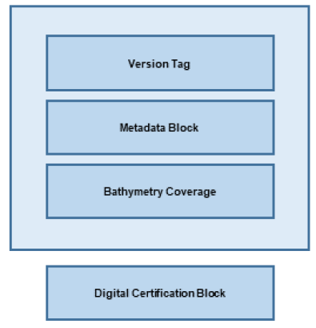
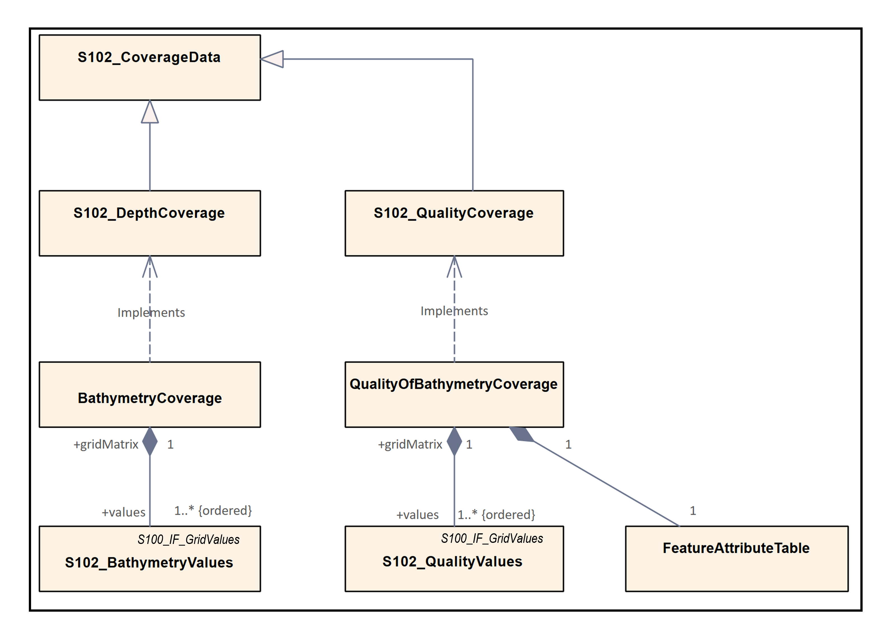
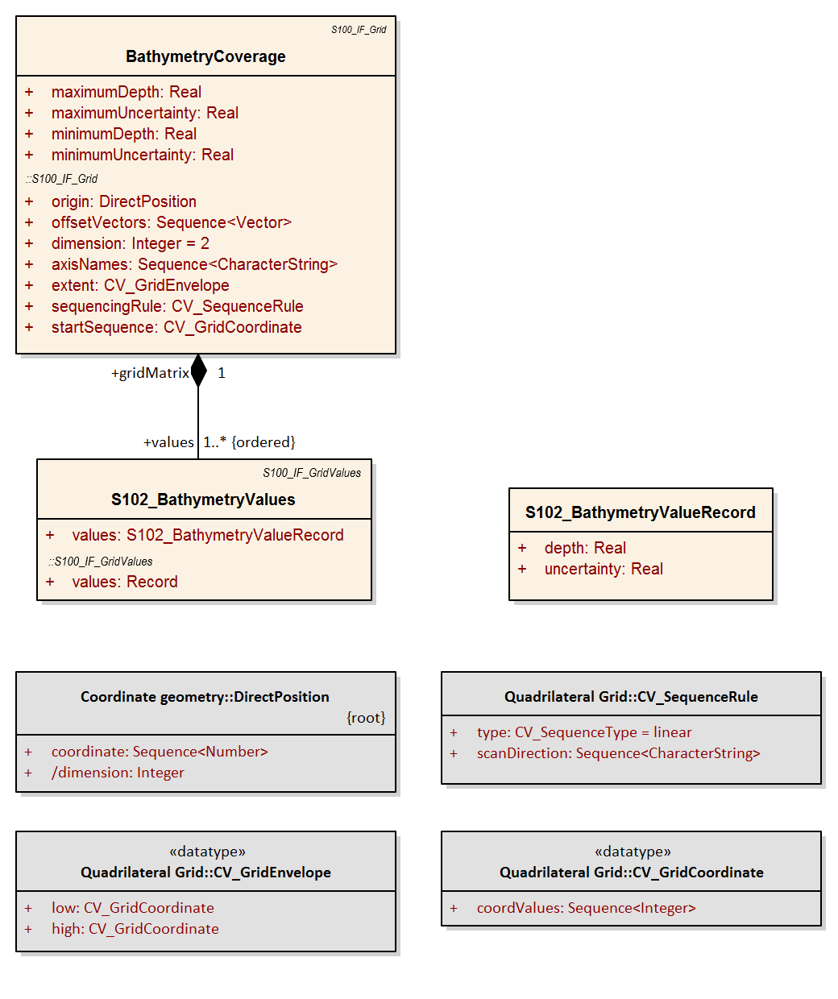
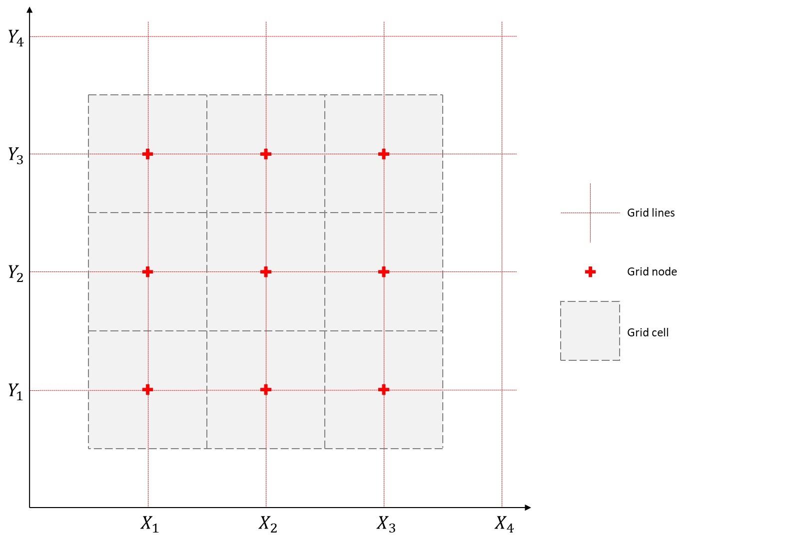
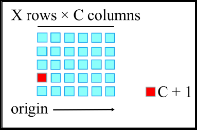

[[sec-data-content-and-structure]]
== Data Content and Structure

=== Introduction
The Bathymetric Surface Product incorporates aspects of the Navigation Surface concept where in addition to estimation of depth, an optional estimate of the uncertainty associated with the depth can be computed and preserved. <<fig-overview-structure-s102>> below shows a high-level overview of the structure of S-102. It shows that the Bathymetric Surface Product consists of a set of data comprising the HDF5 datasets plus a Digital Certification Block. The Digital Certification Block is mandatory so that the user can trace whether the data has been certified. The HDF5 file consists of metadata (spatial, feature and discovery) and collocated coverages consisting of depth values, uncertainty values, and references to metadata records. S-102 uses the S-100 Data Protection Scheme to ensure certification and authentication.

[[fig-overview-structure-s102]]
.Overview Structure of S-102

Thus, the Bathymetric Surface Product is a hybrid of coverages, as defined in <<iho-s100,part=8>>, and metadata packages as defined in <<iho-s100,part=4>>. This is described in <<subsec-application-schema>>.

[[subsec-application-schema]]
=== Application Schema
The Application Schema Data Set Structure is shown in <<fig-data-set-structure-s102>> and <<fig-coverage-structure-of-s102>>. They show a number of classes specialized for use in S-102 and six sets of implementation classes. An actual data set of S-102 bathymetry data contains only the implementation classes. All of the required attributes from the other classes in the application schema are satisfied by statements within the Product Specification. This approach to producing the Application Schema results in a very simple structure for implementation.

[[fig-data-set-structure-s102]]
.Data Set Structure of S-102
image::../images/figure-data-set-structure-s102.png[UML diagram depicting the Application Schema Data Set Structure as described between this figure and the Coverage Structure figure]

The model in <<fig-data-set-structure-s102>> states that:

* An S-102 data set (*S102_DataSet*), which is inherited from *S100_DataSet*, references an S-102 Image and Gridded Data Collection (*S102_IGCollection*). In S-100 it is possible to have multiple collections but in S-102 only one is needed to hold the bathymetry coverage. The S-102 discovery metadata class (*S102_DiscoveryMetadata*) describes the metadata entities required for the identification of the entire data set. The required discovery metadata is implemented through the *S100_DatasetDiscoveryMetadata* class defined in <<iho-s100,part=17>>.

* An instance of an S-102 Image and Gridded Data Collection (*S102_IGCollection*) which is a subtype of *S100_IGCollection*, is described by a set of S-102 Collection Metadata (*S102_CollectionMetadata*). This relationship is 1 to 1 meaning that there is one set of collection metadata for each instance of *S102_IGCollection*. There is a large choice of metadata that may be used in an S-100 compliant data product. Only a small amount of this metadata is mandated by <<iso-19115-1>> for discovery. This edition of S-102 neither uses ISO metadata files nor extends S-100 generic metadata and therefore *S102_CollectionMetadata*, *S102_StructuralMetadata*, *S102_QualityMetadata*, and *S102_AcquisitionMetadata* are abstract classes as described in <<iho-s100,part=8,clause=8.5.3>>. This edition of S-102 uses the dataset metadata elements defined in <<iho-s100,part=17>> and <<iho-s100,part=10c>> with restrictions defined in this product specification. The metadata elements defined in <<iho-s100,part=17>> are encoded in a discovery block within the exchange catalogue (<<iho-s100,part=17,clause=17.4.4>> to <<iho-s100,part=17,clause=17.4.5>>), and the metadata elements defined in <<iho-s100,part=10c>> are encoded as attributes and datasets within the HDF5 file (<<iho-s100,part=10c,clause=10c.9.2>>). The conceptual structure of coverage features in an S-102 dataset is discussed further in <<subsec-application-schema-implementation-classes>>.

[[fig-coverage-structure-of-s102]]
.Coverage Structure of S-102

The model in <<fig-coverage-structure-of-s102>> depicts the coverage type in this application schema: 

* The coverage type for *BathymetryCoverage* is a continuous Regular Grid Coverage called *S102_DepthCoverage* which inherits from *S100_IF_GridCoverage*. Many of the parameters of the coverage are described in the Product Specification.

* The coverage type for *QualityOfBathymetryCoverage* is a continuous Regular Grid Coverage called *S102_QualityCoverage* which inherits from *S100_IF_GridCoverage*. Many of the parameters of the coverage are described in the Product Specification.

[[subsec-application-schema-implementation-classes]]
==== Application Schema implementation classes
The implementation classes for the template application schema are shown in <<fig-implementation-of-classes>>. The attributes are shown for the coverage related classes together with the attribute classes.

In order to simplify the implementation, a number of defaults are assumed for S-102. These defaults simplify implementation and help simplify interaction with the Navigation Surface implementation from the Open Navigation Surface Working Group and other bathymetric gridded types. In the following sub clauses, the default values are emphasized so that they do not need to be encoded when generating an encoding of the implementation classes. However, if specified they must assume the stated values unless other options are stated.

[[fig-implementation-of-classes]]
.Implementation of Classes of S-102

===== Implementation classes description

[level=6]
===== BathymetryCoverage

[level=7]
===== BathymetryCoverage semantics

The class *BathymetryCoverage* has the attributes _minimumDepth_, _maximumDepth_, _minimumUncertainty_, and _maximumUncertainty_ which bound the depth attribute and the uncertainty attribute from the *S102_BathymetryValues* record. *BathymetryCoverage* additionally contains the inherited attributes _origin_, _offsetVectors_, _dimension_, _axisName_, _extent_, _sequenceRule_, and _startSequence_ from *S100_IF_Grid* and *CV_Grid*.

The origin is a position in a specified coordinate reference system, and a set of offset vectors specify the direction and distance between the grid lines. It also contains the additional geometric characteristics of a rectified grid.

[level=7]
===== minimumDepth

The attribute _minimumDepth_ has the value type _Real_ and describes the lower bound of the depth estimate for all the _depth_ values in *S102_BathymetryValues* record. This attribute is required. There is no default.

[level=7]
===== maximumDepth

The attribute _maximumDepth_ has the value type _Real_ and describes the upper bound of the depth estimate for all the _depth_ values in *S102_BathymetryValues* record. This attribute is required. There is no default.

[level=7]
===== minimumUncertainty

The attribute _minimumUncertainty_ has the value type _Real_ and describes the lower bound of the uncertainty of the depth estimate for all the _depth_ values in *S102_BathymetryValues* record. If all uncertainty values are populated with the fill value (i.e., if no actual uncertainties exist in the data), this attribute shall be populated with the fill value. This attribute is required. There is no default.

[level=7]
===== maximumUncertainty

The attribute _maximumUncertainty_ has the value type _Real_ and describes the upper bound of the uncertainty of the depth estimate for all the _depth_ values in *S102_BathymetryValues* record. If all uncertainty values are populated with the fill value (i.e., if no actual uncertainties exist in the data), this attribute shall be populated with the fill value. This attribute is required. There is no default.

[level=7]
===== origin

The attribute _origin_ has the value class _DirectPosition_ which is a position that shall locate the origin of the rectified grid in the coordinate reference system. This attribute is required. There is no default. In the encoding this is split into properties gridOriginLatitude and gridOriginLongitude.

[level=7]
===== offsetVectors

The attribute _offsetVectors_ has the value class _Sequence<Vector>_ that shall be a sequence of offset vector elements that determine the grid spacing in each direction. The data type Vector is specified in <<iso-19103>>. This attribute is required. There is no default. The HDF5 encoding implements and simplifies _offsetVectors_ in the form of two HDF5 attributes: gridSpacingLatitudinal and gridSpacingLongitudinal.

[level=7]
===== dimension

The attribute _dimension_ has the value class Integer that shall identify the dimensionality of the grid. The value of the grid dimension in this product specification is 2. This value is [underline]#fixed# in this Product Specification.

[level=7]
===== axisNames

The attribute _axisNames_ has the value class _Sequence<CharacterString>_ that shall be used to assign names to the grid axis. The grid axis names shall conform to those of the CRS. For the allowable CRS according to this specification, the axis names shall be "Latitude" and "Longitude" for unprojected data sets or "`Northing`" and "`Easting`" in a projected space.

[level=7]
===== extent

The attribute _extent_ has the value class *CV_GridEnvelope* that shall contain the extent of the spatial domain of the coverage. It uses the value class *CV_GridEnvelope* which provides the grid coordinate values for the diametrically opposed corners of the grid. The [underline]#default is that this value is derived# from the bounding box for the data set. The extent of the dataset limits is defined as a rectangle coincident with the outermost cell boundaries of the dataset. In the encoding the property BoundingBox is used to hold the extent.

[level=7]
===== sequencingRule

The attribute _sequencingRule_ has the value class *CV_SequenceType* that shall describe how the grid points are ordered for association to the elements of the sequence values. The [underline]#default value is "linear". No other options are allowed.#

[level=7]
===== startSequence

The attribute _startSequence_ has the value class *CV_GridCoordinate* that shall identify the grid point to be associated with the first record in the values sequence. The [underline]#default value is the lower left corner# of the grid. No other options are allowed.

[level=6]
===== S102_BathymetryValues

[level=7]
===== S102_BathymetryValues semantics

The class *S102_BathymetryValues* is related to *BathymetryCoverage* by a composition relationship in which an ordered sequence of _depth_ values provide data values for each grid cell. The class *S102_BathymetryValues* inherits from S100_IF_Grid.

[level=7]
===== values

The attribute _values_ has the value type *_S102_BathymetryValueRecord_*, which is a sequence of value items that shall assign values to the grid points. There are two attributes in the bathymetry value record in the *S102_BathymetryValues* class:

* _depth_ 

* (optional) _uncertainty_ 

[level=6]
===== QualityOfBathymetryCoverage

[level=7]
===== QualityOfBathymetryCoverage semantics

The class *QualityOfBathymetryCoverage* contains the inherited attributes _origin_, _offsetVectors_, _dimension_, _axisName_, _extent_, _sequenceRule_, and _startSequence_ from *S100_IF_Grid* and *CV_Grid*.

The origin is a position in a specified coordinate reference system, and a set of offset vectors specify the direction and distance between the grid lines. It also contains the additional geometric characteristics of a rectified grid.

[level=7]
===== origin

The attribute _origin_ has the value class _DirectPosition_ which is a position that shall locate the origin of the rectified grid in the coordinate reference system. This attribute is required. There is no default. In the encoding this is split into properties gridOriginLatitude and gridOriginLongitude.

[level=7]
===== offsetVectors

The attribute _offsetVectors_ has the value class _Sequence<Vector>_ that shall be a sequence of offset vector elements that determine the grid spacing in each direction. The data type Vector is specified in <<iso-19103>>. This attribute is required. There is no default. The HDF5 encoding implements and simplifies _offsetVectors_ in the form of two HDF5 attributes: gridSpacingLatitudinal and gridSpacingLongitudinal.

[level=7]
===== dimension

The attribute _dimension_ has the value class Integer that shall identify the dimensionality of the grid. The value of the grid dimension in this product specification is 2. This value is [underline]#fixed# in this Product Specification and does not need to be encoded.

[level=7]
===== axisNames

The attribute _axisNames_ has the value class _Sequence<CharacterString>_ that shall be used to assign names to the grid axis. The grid axis names shall conform to those of the CRS. For the allowable CRS according to this specification, the axis names shall be "Latitude" and "Longitude" for unprojected data sets or "`Northing`" and "`Easting`" in a projected space.

[level=7]
===== extent

The attribute _extent_ has the value class *CV_GridEnvelope* that shall contain the extent of the spatial domain of the coverage. It uses the value class *CV_GridEnvelope* which provides the grid coordinate values for the diametrically opposed corners of the grid. The [underline]#default is that this value is derived# from the bounding box for the data set. The extent of the dataset limits is defined as a rectangle coincident with the outermost cell boundaries of the dataset. In the encoding the property BoundingBox is used to hold the extent.

[level=7]
===== sequencingRule

The attribute _sequencingRule_ has the value class *CV_SequenceType* that shall describe how the grid points are ordered for association to the elements of the sequence values. The [underline]#default value is "linear". No other options are allowed.#

[level=7]
===== startSequence

The attribute _startSequence_ has the value class *CV_GridCoordinate* that shall identify the grid point to be associated with the first record in the values sequence. The [underline]#default value is the lower left corner# of the grid. No other options are allowed.

[level=6]
===== S102_QualityValues

[level=7]
===== S102_QualityValues semantics

The class *S102_QualityValues* is related to *QualityOfBathymetryCoverage* by a composition relationship in which an ordered sequence of _id_ values provide for each cell references to metadata. The class *S102_QualityValues* inherits from S100_IF_Grid.

[level=7]
===== values

The attribute _values_ has the value type *_S102_QualityValueRecord_* which is a sequence of value items that shall assign values to the grid points. There is one attribute in the quality value record, _id_, in the *S102_QualityValues* class.

[level=6]
===== DirectPosition

[level=7]
===== DirectPosition semantics

The class DirectPosition hold the coordinates for a position within some coordinate reference system.

[level=7]
===== coordinate

The attribute _coordinate_ is a sequence of Numbers that hold the coordinate of this position in the specified reference system.

[level=7]
===== dimension

The attribute _dimension_ is a derived attribute that describes the number of coordinate axes.

[level=6]
===== CV_GridEnvelope

[level=7]
===== CV_GridEnvelope semantics

The class *CV_GridEnvelope* provides the grid coordinate values for the diametrically opposed corners of an envelope that bounds a grid. It has two attributes.

[level=7]
===== low

The attribute _low_ shall be the minimum coordinate values for each coordinate axis among all grid cells within the envelope. For this specification the value is the southwesternmost grid point coordinate minus half of the grid spacing for each coordinate axis.

[level=7]
===== high

The attribute _high_ shall be the maximum coordinate values for each coordinate axis among all grid cells within the envelope. For this specification the value is the northeasternmost grid point coordinate plus half of the grid spacing for each coordinate axis.

[level=6]
===== CV_GridCoordinate

[level=7]
===== CV_GridCoordinate semantics

The class *CV_GridCoordinate* is a data type for holding the grid coordinates of a *CV_GridPoint*.

[level=7]
===== coordValues

The attribute _coordValues_ has the value class _Sequence<Integer>_ that shall hold one integer value for each dimension of the grid. The ordering of these coordinate values shall be the same as that of the elements of _axisNames_. The value of a single coordinate shall be the number of offsets from the origin of the grid in the direction of a specific axis.

[level=6]
===== CV_SequenceRule

[level=7]
===== CV_SequenceRule semantics

The class *CV_SequenceRule* contains information for mapping grid coordinates to a position within the sequence of records of feature attribute values. It has two attributes.

[level=7]
===== type

The attribute _type_ shall identify the type of sequencing method that shall be used. A code list of scan types is provided in <<iho-s100,part=10c>>. Only the value "linear" shall be used in S-102, which describes scanning row by row by column.

[level=7]
[[scanDirection]]
===== scanDirection

The attribute _scanDirection_ has the value class _Sequence<CharacterString>_: a list of axis names that indicates the order in which grid points shall be mapped to position within the sequence of records of feature attribute values.

=== Feature Catalogue

==== Introduction
The S-102 Feature Catalogue describes the feature types, attributes and attribute values which may be used in the product.

[[tsf]]The S-102 Feature Catalogue is available in an XML document which conforms to the S-100 XML Feature Catalogue Schema and can be downloaded from the IHO Geospatial Information Registry.[[ihoweb]]

==== Feature types
S-102 is a coverage feature product. *BathymetryCoverage* implements *S102_DepthCoverage* and includes *S102_BathymetryValues*. *QualityOfBathymetryCoverage* implements *S102_QualityCoverage* and includes *S102_QualityValues*.

===== Geographic
Geographic (geo) feature types form the principle content of the dataset and are fully defined by their associated attributes. In S-102, *BathymetryCoverage* has been registered as a geographic feature type.

===== Meta
Meta feature types are allowed in the dataset and are fully defined by their associated attributes. In S-102, *QualityOfBathymetryCoverage* has been registered as a meta feature type.

==== Feature relationship
S-102 does not use any feature relationships.

==== Attributes

===== Simple attributes

In S-102, _depth_ and _uncertainty_ have been registered as simple attributes, type `<real>`; and _iD_ has been registered as a simple attribute, type `<integer>`. Simple attributes are defined in <<iho-s100,part=5,clause=5-4.2.3.3>>. 

===== Complex attributes
In S-102 there are currently no complex attributes defined.

=== Dataset types

==== Introduction
Bathymetric Surface datasets are represented as regular grids. The general structure for a regular grid is defined in <<iho-s100,part=8>>. Each sample in a grid represents the value in the grid cell area.

The georeferencing for an S-102 Bathymetric Surface product shall be grid point based, referenced from the southwesternmost grid point. The reference position (grid origin) included in the metadata, precisely the attributes _gridOriginLatitude_ and _gridOriginLongitude_, shall be given in the coordinates used for the grid and shall contain sufficient digits of precision to locate the grid with accuracy no worse than a decimetre on the surface of the ellipsoid of rotation of the chosen horizontal datum.

[[fig-s102-cell-area-and-Bbox]]
.S-102 grid structure. Grid origin is the lower left grid point. Grid cells are centered around grid points. Bounding box is coincident with the outermost grid cell boundaries.

==== Regular grid

===== S-102 coverages
The *BathymetryCoverage* contains _depth_ and, optionally, _uncertainty_. The general structure of each is defined in <<iho-s100,part=8>> as a georectified grid. Similarly, the *QualityOfBathymetryCoverage* contains _id_.

The grid properties of origin and spacing are defined by attributes in the *BathymetryCoverage.nn* and *QualityOfBathymetryCoverage.01* Feature Instance Groups. Each grid is a two-dimensional matrix organized in row major order and starting from the southwesternmost grid point. Thus, for each grid, the first sample is the point at the southwest corner of the grid with location specified by the georeferencing parameters, the second is one grid resolution unit to the east of that position and at the same northing or latitude, and the third is two grid resolution units to the east and at the same northing or latitude. For stem:[C] columns in the grid, the stem:[(C+1)]^th^ sample in the grid is located one grid resolution unit to the north but on the same easting or longitude as the first sample in the grid.

[[fig-s102-grid-point-location]]
.S-102 Grid point location

For *BathymetryCoverage.nn*, _depth_ and optional _uncertainty_, are stored in the same grid as members of a data compound. The units of the depth values are in metres. The vertical distance is from a given water level to the bottom. Drying heights (drying soundings) are indicated by a negative depth value. For *QualityOfBathymetryCoverage.01*, only _id_ is stored in the grid.

The unknown state for depth is defined to be 1,000,000.0 (1.0e6).

The uncertainty values are expressed as positive quantities at each grid cell. As detailed in <<tab-elements-of-featureAttributeTable-compound-datatype>> and <<tab-codes-defining-how-bathy-depth-uncertainty-determined>> the uncertainty grid supports multiple definitions of vertical uncertainty. A recipient of an S-102 file can refer to the uncertainty definition in the Metadata to gain an understanding of how the uncertainty was computed.

The undetermined state for uncertainty is defined to be 1,000,000.0 (1.0e6).

The _id_ values in *QualityOfBathymetryCoverage.01* are expressed as unsigned 32-bit integer at each grid cell. Each value corresponds to the identifier for a metadata record in a *featureAttributeTable* <<root-QualityOfBathymetryCoverage>>. 

The fill value for _id_ is defined to be 0.

===== Extensions
In S-102 there are currently no extensions defined.

=== Multiple datasets
In order to facilitate the efficient processing of S-102 data, the geographic coverage of a given *maximum display Scale* may be split into multiple datasets.

=== Dataset rules
Each S-102 dataset must only have a single extent as it is a coverage feature. 

There should be no overlapping data of the same maximum display scale, except at the agreed adjoining limits. Where it is difficult to achieve a perfect join, a buffer to be agreed upon by the producing agencies may be used. 

=== Geometry
S-102 regular gridded coverages are an implementation of S100_IF_GridCoverage <<iho-s100,part=8,clause=8.7>>. 
