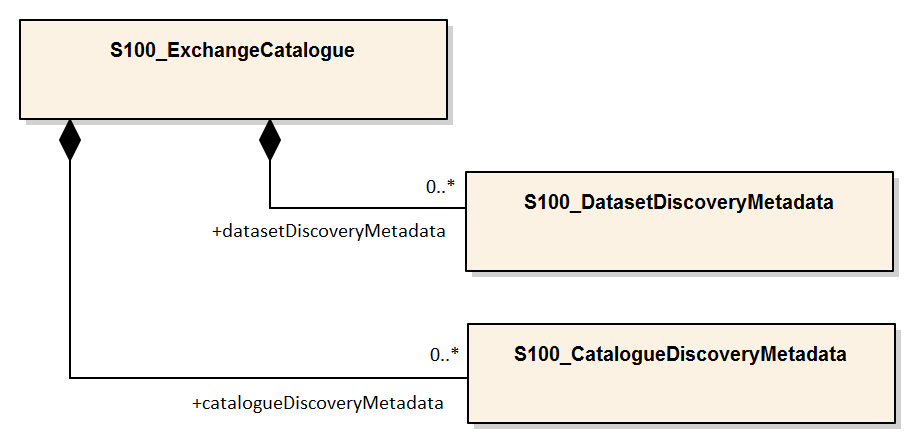
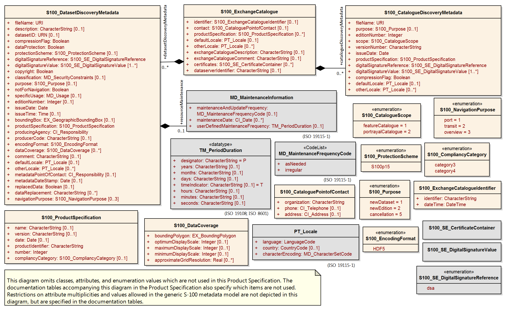

[[sec-metadata]]
== Metadata

//Since S-102 now describes a “navigation product” intended for ECDIS use: (a) ISO metadata files are not needed - ECDIS doesn’t have to read them; and (b) any “extra” metadata (metadata not defined in Part 17) should, at least in this edition, *not* be added to the exchange catalogue. If such extra metadata *has* to be provided, it should be as HDF5 attributes in the root group. (RM Comment 23Jan2023)

//With the removal of ISO metadata files, the metadata attributes in the old Sections 12.2 (Discovery metadata) and 12.3 (Structure metadata) are not encoded anywhere and these clauses have been deleted. The attributes depthCorrectionType and verticalUncertaintyType are also not encoded anywhere in the “navigation” version of S-102. (RM Comment 20 Mar 2023)

=== Introduction
The Metadata elements used in the Bathymetric Surface product are derived from S-100 and from <<iso-19115-1>> and <<iso-19115-2>>. Optionally additional metadata may be derived from <<iso-ts-19130>> and <<iso-ts-19130-2>> especially metadata relating to the sonar equipment which may have been used to acquire the bathymetric data.

S-102 metadata is encoded in two places:

* Metadata used for the discovery, identification, and use of S-102 datasets in S-100-based navigations systems (specifically, an S-100-capable ECDIS) is encoded in the exchange catalogue. This metadata conforms to S-100 Part 17, with product-specific restrictions added.

* Metadata required by the S-100 HDF5 encoding (<<iho-s100,part=10c>>) and product-specific metadata defined by this product specification are encoded at various levels in the HDF5 group hierarchy, as specified by <<iho-s100,part=10c>> or <<subsec-product-structure>>.

[[subsec-exchange-set-metadata]]
=== Exchange Set metadata
For information exchange, there are several categories of metadata required: metadata about the overall Exchange Catalogue, metadata about each of the datasets contained in the Catalogue.

<<fig-components-and-associated-metadata-for-the-s102-exchange-set>> depicts the relationships of exchange set elements (datasets and feature/portrayal catalogues) and exchange set metadata. This figure is derived from <<iho-s100,part=17,figure=2>> with relationships not applicable to S-102 omitted.

<<fig-relationship-between-exchange-catalogue-discovery-metadata-and-dataset>> depicts the structure of the exchange catalogue and its component discovery metadata blocks. The structure is the same as in <<iho-s100,part=17>>.

More detailed information about the various classes is shown in <<fig-s102-exchange-set-class-details>> with further description in <<tab-s100-datasetDiscoveryMetadata-params;to!sec-pt-locale>>. In the cases in which classes are used without modification, refer to <<iho-s100,part=17>> for their descriptions.

The discovery metadata classes have numerous attributes which enable important information about the datasets to be examined without the need to process the data (e.g., decryption, decompression, loading). Other Catalogues can be included in the Exchange Set in support of the datasets such as Feature and Portrayal.

[[fig-components-and-associated-metadata-for-the-s102-exchange-set]]
.Components and associated metadata for the S-102 exchange set (<<iho-s100,part=17,figure=2>> with items not used by S-102 omitted)
image::../images/figure-components-and-associated-metadata-for-the-s102-exchange-set.png[]

[[fig-relationship-between-exchange-catalogue-discovery-metadata-and-dataset]]
.Relationship between exchange catalogue, discovery metadata, and dataset (<<iho-s100,part=17,figure=6>> with items not used by S-102 omitted)

[%landscape]
<<<
[[fig-s102-exchange-set-class-details]]
.S-102 Exchange Set Class Details (<<iho-s100,part=17,figure=7>> with items not used by S-102 omitted)

[%portrait]
<<<

The following clauses define the mandatory and optional metadata needed for S-102. In some cases, the metadata may be repeated in a national language. If this is the case it is noted in the Remarks column.

The XML schemas for S-102 exchange catalogues will be available from the IHO Geospatial Information (GI) Registry and/or the S-100 GitHub site (https://github.com/IHO-S100WG).

The S-102 exchange catalogue uses the S-100 exchange catalogue schemas which are available from the S-100 schema server at https://schemas.s100dev.net (downloadable archives are also available on the site for offline use). Implementation of the S-102-specific constraints described in following clauses below is left to developer decision as it can be done in various ways depending on implementation frameworks and the requirements of production or application software.

=== Language

The exchange language must be English.

Character strings must be encoded using the character set defined in <<iso-10646-1>>, in Unicode Transformation Format-8 (UTF-8). A BOM (byte order mark) must not be used.

[%landscape]
<<<

[[subsec-s100_exchangecatalogue]]
=== S100_ExchangeCatalogue

Each Exchange Set has a single S100_ExchangeCatalogue which contains meta information for the data in the Exchange Set.

S-102 uses S100_ExchangeCatalogue without modification. 

==== S100_ExchangeCatalogueIdentifier
S-102 uses S100_ExchangeCatalogueIdentifier without modification.

==== S100_CataloguePointOfContact
S-102 uses S100_CataloguePointOfContact without modification.

=== S100_DatasetDiscoveryMetadata
Dataset discovery metadata in S-102 restricts certain attributes and roles as described in <<tab-s100-datasetDiscoveryMetadata-params>>. Optional S-100 attributes which are mandatory in S-102 are indicated in the Remarks column.

[[tab-s100-datasetDiscoveryMetadata-params]]
.S100_DatasetDiscoveryMetadata parameters
[cols="a,a,a,^a,a,a",options="header"]
|===
|Role name |Name |Description |Mult |Type |Remarks

|Class
|S100_DatasetDiscoveryMetadata
|Metadata about the individual datasets in the Exchange Catalogue
|-
|-
|*The optional S-100 attributes _updateNumber_, _updateApplicationDate_, _referenceID_, and _temporalExtent_ are not used in S-102.* +
*References to support file discovery metadata are not permitted because S-102 does not use support files.*

|Attribute
|fileName
|Dataset file name
|1
|URI
|See <<iho-s100,part=1,clause=4.6>> +
*Format: file:/S-102/DATASET_FILES/<dsname>* +
*Dataset file name <dsname> must be according to format defined in <<subsec-dataset-file-naming>>.*

|Attribute
|description
|Short description giving the area or location covered by the dataset
|0..1
|CharacterString
|For example a harbour or port name, between two named locations, etc.

|Attribute
|datasetID
|Dataset ID expressed as a Maritime Resource Name
|0..1
|URN
|The URN must be an MRN. +
*See <<iho-s100,part=3,clause=10>>*

|Attribute
|compressionFlag
|Indicates if the resource is compressed
|1
|Boolean
|_True_ indicates a compressed dataset resource. +
_False_ indicates an uncompressed dataset resource.

|Attribute
|dataProtection
|Indicates if the data is encrypted
|1
|Boolean
|_True_ indicates an encrypted dataset resource. +
_False_ indicates an unencrypted dataset resource.

|Attribute
|protectionScheme
|Specification of method used for data protection
|0..1
|S100_ProtectionScheme
|*Populate if and only if _dataProtection_ = _True_.*

|Attribute
|digitalSignatureReference
|Specifies the algorithm used to compute _digitalSignatureValue_
|1
|S100_SE_DigitalSignatureReference
|*See <<iho-s100,part=15,clause8.11.7>> & <<sec-certs-digsign>>*

|Attribute
|digitalSignatureValue
|Value derived from the digital signature
|1..*
|S100_SE_DigitalSignature
|*see <<iho-s100,part=15,clause=15-8.11.3>>* +
The value resulting from application of _digitalSignatureReference_ +
Implemented as the digital signature format specified in <<iho-s100,part=15>>

|Attribute
|copyright
|Indicates if the dataset is copyrighted
|1
|Boolean
|_True_ indicates the resource is copyrighted. +
_False_ indicates the resource is not copyrighted.

|Attribute
|classification
|Indicates the security classification of the dataset
|1
|Class +
MD_SecurityConstraints>MD_ClassificationCode (codelist)
|*Mandatory in S-102* +
[loweralpha]
. unclassified
. restricted
. confidential
. secret
. top secret
. sensitive but unclassified
. for official use only
. protected
. limited distribution

|Attribute
|purpose
|The purpose for which the dataset has been issued
|*1*
|S100_Purpose
|*Mandatory in S-102*

|Attribute
|notForNavigation
|Indicates the dataset is not intended to be used for navigation
|1
|Boolean
|_True_ indicates the dataset *is not* intended to be used for navigation. +
_False_ indicates the dataset *is* intended to be used for navigation.

|Attribute
|specificUsage
|The use for which the dataset is intended
|0..1
|MD_USAGE>specificUsage (character string)
|-

|Attribute
|editionNumber
|The edition number of the dataset
|*1*
//Superfluous for product without updates and reissues; S-102 will always replace the full product file; change to 0 as possible accourding to S100 (RohdeBSH 07. June 2024)
|Integer
|When a data set is initially created, the Edition number 1 is assigned to it. The Edition number is increased by 1 at each new Edition. Edition number remains the same for a re-issue. +
*Mandatory in S-102*

|Attribute
|issueDate
|Date on which the data was made available by the Data Producer
|1
|Date
|-

|Attribute
|issueTime
|Time of day at which the data was made available by the Data Producer
|0..1
|Time
|The S-100 datatype Time +
*May be required if multiple instances of a product are issued on the same day.*

|Attribute
|boundingBox
|The extent of the dataset limits
|*1*
|EX_GeographicBoundingBox
|*Mandatory in S-102* +
*Defined as a rectangle coincident with the outermost cell boundaries of the dataset.*

|Attribute
|productSpecification
|The Product Specification used to create this dataset
|1
|S100_ProductSpecification
|*<<tab-s100-productSpecification-params>>*

|Attribute
|producingAgency
|Agency responsible for producing the data
|1
|CI_Responsibility>CI_Organisation
|See <<iho-s100,part=17,table=17-3>>

|Attribute
|producerCode
|The official IHO Producer Code from S-62
|1
|CharacterString
|*Mandatory in S-102*

|Attribute
|encodingFormat
|The encoding format of the dataset
|1
|S100_EncodingFormat
|*The only allowed value is HDF5* +
*<<tab-s100-encodingFormat-params>>*

|Attribute
|dataCoverage
|Provides information about data coverages within the dataset
|*1*..*
|S100_DataCoverage
|*Mandatory in S-102* +
*<<tab-s100-dataCoverage-params>>*

|Attribute
|comment
|Any additional information
|0..1
|CharacterString
|-

|Attribute
|defaultLocale
|Default language and character set used in the dataset
|0..1
|PT_Locale
|In absence of defaultLocale, the language is English, and the character set is UTF-8.

|Attribute
|otherLocale
|Other languages and character sets used in the dataset
|0..*
|PT_Locale
|

|Attribute
|metadataPointOfContact
|Point of contact for metadata
|0..1
|CI_Responsibility>CI_Individual +
or +
CI_Responsibility>CI_Organisation
|Only if metadataPointOfContact differs from producingAgency

|Attribute
|metadataDateStamp
|Date stamp for metadata
|0..1
|Date
|May or may not be the issue date

|Attribute
|replacedData
|Indicates if a cancelled dataset is replaced by another data file(s)
|0..1
|Boolean
|See note following <<iho-s100,part=17,table=S100_DatasetDiscoveryMetadata>> +
*Mandatory when purpose = cancellation*

|Attribute
|dataReplacement
|Dataset name
|0..*
|CharacterString
|A dataset may be replaced by 1 or more datasets. +
*Dataset name must be according to format defined in <<subsec-dataset-file-naming>>.* +
*For example, _102DE00KD54.H5_* +
See note following <<iho-s100,part=17,table=S100_DatasetDiscoveryMetadata>> +
*Mandatory when replacedData = true*

|Attribute
|navigationPurpose
|Classification of intended navigation purpose (for Catalogue indexing purposes)
|*1*..3
|S100_NavigationPurpose
|If Product Specification is intended for creation of navigational products, this attribute should be mandatory. +
*Mandatory in S-102*

|Role
|resourceMaintenance
|Information about the frequency of resource updates, and the scope of those updates
|0..1
|MD_MaintenanceInformation
|S-100 restricts the multiplicity to 0..1 and adds specific restrictions on the ISO 19115 structure and content. See <<iho-s100,part=17>>. +
Format: PnYnMnDTnHnMnS (XML built-in type for ISO 8601 duration). See <<iho-s100,part=17,clause=4.9>>. +
*S-102 discovery metadata blocks should populate maintenance information if and only if the date of the next edition is definite, whether it is due on a regular or irregular schedule.*

|===

==== S100_NavigationPurpose
S-102 uses S100_NavigationPurpose without modification.

==== S100_DataCoverage
S-102 uses S100_DataCoverage without modification, but with additional remarks and changes to the multiplicity.

[[tab-s100-dataCoverage-params]]
.S100_DataCoverage parameters
[cols="a,a,a,^a,a,a",options="header"]
|===
|Role name |Name |Description |Mult |Type |Remarks

|Class
|S100_DataCoverage
|A spatial extent where data is provided along with the display scale information for the provided data
|-
|-
|This field is used by user systems as part of the data loading and unloading algorithms, and it is strongly encouraged that Product Specifications mandate the use of one or more of the displayScale provided as part of S100_DataCoverage.

|Attribute
|boundingPolygon
|A polygon which defines the actual data limit
|1
|EX_BoundingPolygon
|<<note-s100datacoverage-boundingPolygon>>

|Attribute
|temporalExtent
|Specification of the temporal extent of the coverage
|*0*
|S100_TemporalExtent
|*The _temporalExtent_ is not used in S-102.*

|Attribute
|optimumDisplayScale
|The scale at which the data is optimally displayed
|0..1
|Integer
|Example: A scale of 1:25000 is encoded as 25000

|Attribute
|maximumDisplayScale
|The maximum scale at which the data is displayed
|0..1
|Integer
|

|Attribute
|minimumDisplayScale
|The minimum scale at which the data is displayed
|0..1
|Integer
|

|Attribute
|approximateGridResolution
|The resolution of gridded or georeferenced data (in metres)
|*1..2*
|Real
|*Mandatory in S-102* +
A single value may be provided when all axes have a common resolution. +
For multiple value provision, use axis order as specified in dataset. +
For example, for 5 metre resolution, the value 5 must be encoded. +
If the grid cell size varies over the extent of the grid +
(i.e., when using a geographic grid), an approximated value should be used.
|===
[[note-s100datacoverage-boundingPolygon]]
[NOTE]
====
_boundingPolygon_ is restricted to a single GML Polygon with one exterior and 0 or more interiors expressed as Linear Rings using SRS EPSG:4326. The exterior and optional interiors shall be composed of a closed sequence of >=4 coordinate positions expressed individually or as a list (posList). The GML polygon shall have a valid GML identifier.
====

==== S100_Purpose
S-102 uses S100_Purpose without modification, but with a restriction on the allowed values.

[[tab-s100-purpose]]
.S100_Purpose
[cols="a,a,a,^a,a,options="header"]
|===
|Role name |Name |Description |Code |Remarks

|Enumeration
|S100_Purpose
|The purpose of the dataset
|-
|*The S-100 values _update_, _reissue_, and _delta_ are not used in S-102.*

|Value
|newDataset
|Brand new dataset
|1
|No data has previously been produced for this area.

|Value
|newEdition
|New edition of the dataset or Catalogue
|2
|Includes new information which has not been previously distributed by updates.

|Value
|cancellation
|Dataset or Catalogue that has been cancelled
|5
|Indicates the dataset or Catalogue should no longer be used and can be deleted.
|===

==== S100_EncodingFormat
S-102 uses S100_EncodingFormat with a restriction on the allowed values to permit only the S-100 HDF5 format for S-102 datasets.

[[tab-s100-encodingFormat-params]]
.S100_EncodingFormat parameters
[cols="a,a,a,^a,a",options="header"]
|===
|Role name |Name |Description |Code |Remarks

|Enumeration
|S100_EncodingFormat
|The encoding format
|-
|*The only value allowed in S-102 is "`HDF5`".*

|Value
|HDF5
|The HDF5 data format as defined in <<iho-s100,part=10c>>
|3
|-
|===

==== S100_ProductSpecification
S-102 uses S100_ProductSpecification without modification, but with additional remarks and changes to the multiplicity.

[[tab-s100-productSpecification-params]]
.S100_ProductSpecification parameters
[cols="a,a,a,^a,a,a",options="header"]
|===
|Role name |Name |Description |Mult |Type |Remarks

|Class
|S100_ProductSpecification
|The Product Specification contains the information needed to build the specified product.
|-
|-
|-

|Attribute
|name
|The name of the Product Specification used to create the datasets
|*1*
|CharacterString
|The name in the GI Registry should be used for this field. +
*For S-102, this name is "Bathymetric Surface" (as of 25 June 2024).*

|Attribute
|version
|The version number of the Product Specification
|*1*
|CharacterString
|TR 2/2007 specifies versioning of Product Specifications +
*Example: 3.0.0 for S-102 Edition 3.0.0*

|Attribute
|date
|The version date of the Product Specification
|*1*
|Date
|-

|Attribute
|productIdentifier
|Machine readable unique identifier of a product type
|1
|CharacterString +
(Restricted to Product ID values from the IHO Product Specification Register in the IHO Geospatial Information (GI) Registry)
|*For S-102, this identifier is "S-102" (without quotes).*

|Attribute
|number
|The number used to lookup the product in the Product Specification Register of the IHO GI registry
|1
|Integer
|For IHO Product Specifications, these numbers should be taken from the IHO Product Specification Register in the IHO GI Registry. +
*The corresponding Idx-number of the IHO Registry for S-102 is numbered 199.*

|Attribute
|compliancyCategory
|The level of compliance of the Product Specification to S-100
|0..1
|S100_CompliancyCategory
|See <<iho-s100,part=4a,clause=4a-5.5>> *and <<subsec-s100-compliancy-category>> below.*
|===

[[subsec-s100-compliancy-category]]
==== S100_CompliancyCategory
S-102 exchange sets conforming to this edition of S-102 and using a CRS from the EPSG registry may be encoded as category 3 or 4 when the _compliancyCategory_ metadata attribute is populated. Because S-98 interoperability assumes _category4_ datasets, _category4_ may be used for test purposes, though the absence of test datasets and of a published IHO interoperability catalogue mean this edition of S-102 does not yet qualify for _category4_. *Given the uncertainty about interoperability testing requirements and availability of test datasets, the S-100 WG chair and S-102 PT chair should be consulted for up-to-date guidance.*

[[tab-s100-compliancyCategory]]
.S100_CompliancyCategory
[cols="a,a,a,^a,a",options="header"]
|===
|Role Name |Name |Description |Code |Remarks

|Enumeration
|S100_CompliancyCategory
|-
|-
|*S-102 should use _category3_ or _category4_, subject to the guidance provided in <<subsec-s100-compliancy-category>>.*

|Value
|category3
|IHO S-100 compliant with standard encoding
|3
|*Qualifies as _category2_; plus "The Product Specification uses only an encoding method defined in <<iho-s100,part=10;and!part=4a,clause=5.5.3>>"*

|Value
|category4
|IHO S-100 and IMO harmonized display compliant
|4
|*Qualifies as _category3_; plus additional requirements, including a portrayal catalogue, cybersecurity (digital signatures and encryption), test material, use of a CRS from the EPSG Registry, and compliance with the IHO S-98 interoperability catalogue. <<iho-s100,part=4a,clause=5.5.4>>*

|===

==== S100_ProtectionScheme
S-102 uses S100_ProtectionScheme without modification.

=== MD_MaintenanceInformation
S-102 uses MD_MaintenanceInformation without modification.

=== MD_MaintenanceFrequencyCode
S-102 uses MD_MaintenanceFrequencyCode without modification.

=== S100_CatalogueDiscoveryMetadata
S-102 uses S100_CatalogueDiscoveryMetadata without modification.

==== S100_CatalogueScope
S-102 uses S100_CatalogueScope without modification.

[[sec-pt-locale]]
==== PT_Locale
S-102 uses PT_Locale without modification.
The class PT_Locale is defined in <<iso-19115-1>>. LanguageCode, CountryCode, and MD_CharacterSetCode are ISO codelists which are defined in a codelists file which is part of the S-100 Edition 5.2.0 schema distribution.

[[sec-certs-digsign]]
=== Certificates and Digital Signatures
The classes S100_SE_CertificateContainerType (<<iho-s100,part=15,clause=8.11.1>>), S100_SE_DigitalSignatureReference (<<iho-s100,part=15,clause=8.11.7>>), and S100_SE_DigitalSignature are defined in <<iho-s100,part=15>> and implemented in the S-100 generic schemas.

In accordance with <<iho-s100,part=15>>, only the ECDSA algorithm is allowed from the S100_SE_DigitalSignatureReference enumeration.

S-102 uses S100_SE_DigitalSignature without modification. As stated in <<iho-s100,part=15,clause=15-8.11.3>>:

"The class S100_SE_DigitalSignature is realized as one of either S100_SE_SignatureOnData (a digital signature of a particular identified resource) or an additional digital signature defined using the class S100_SE_AdditionalSignature, each of which is either a S100_SE_SignatureOnData or S100_SE_SignatureOnSignature element as described in <<iho-s100,part=15,clause=8.8>>. <<iho-s100,part=17>> metadata thus allows for multiple digital signatures, a single mandatory S100_SE_SignatureOnData and any number of additional signatures, either of the data or other signatures."
