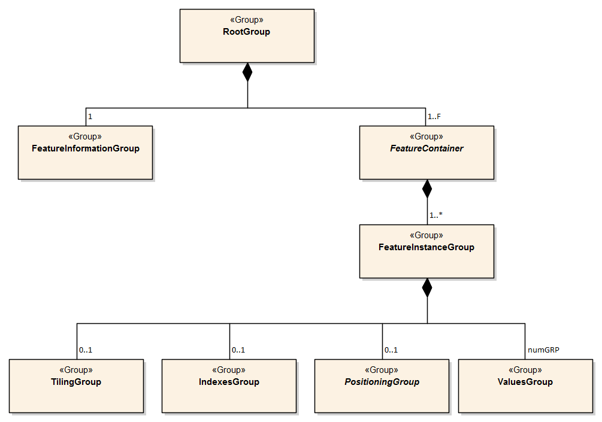

[[sec-data-product-format-encoding]]
== Data Product Format (Encoding)

=== Introduction
The S-102 data set must be encoded using the Hierarchical Data Format standard, Version 5 (HDF5).

*Format Name*:: HDF5

*Version*:: 1.8.8

*Character Set*:: UTF-8

*Specification*:: https://www.hdfgroup.org/

The key idea behind the S-102 product structure is that each coverage is a feature. Each of these features is co-located with the others. Therefore, they share the same spatial metadata, and each is required to correctly interpret the others.

For the use of HDF5, the following key concepts (<<iho-s100,part=10c,clause=5.1>>) are important:

_File_:: a contiguous string of bytes in a computer store (memory, disk, etc.), and the bytes represent zero or more objects of the model;

_Group_:: a collection of objects (including groups);

_Dataset_:: a multidimensional array of data elements with attributes and other metadata;

_Dataspace_:: a description of the dimensions of a multidimensional array;

_Datatype_:: a description of a specific class of data element including its storage layout as a pattern of bits; (Enumerations are encoded with unsigned 8-bit or unsigned 16-bit indices, depending on the number of transported values.)

_Attribute_:: a named data value associated with a group, dataset, or named datatype and stored as a scalar;

_Property List_:: a collection of parameters (some permanent and some transient) controlling options in the library.

In addition, datasets may be a compound (a single record consisting of an array of simple value types) and have multiple dimensions.

[[subsec-product-structure]]
=== Product structure
The structure of the data product follows the form given in <<iho-s100,part=10c>> -- HDF5 Data Model and File Format. The general structure, which was designed for several S-100 products is given in <<fig-outline-of-the-generic-data-file-structure>>.

[[fig-outline-of-the-generic-data-file-structure]]
.Outline of the generic data file structure

<<fig-outline-of-the-generic-data-file-structure>> shows the four levels defined within the HDF encoding as defined in <<iho-s100,part=10c>>. Below is a further definition of these levels.

*Level 1*:: At the top level lies the Root Group, and it contains the Root Metadata and two subsidiary groups. The Root Metadata applies to all S-100 type products.

*Level 2*:: The next Level contains the Feature Information Group and the Feature Container Group. The Feature Information Group contains the feature *BathymetryCoverage*, the feature attribute codes and the optional feature *QualityOfBathymetryCoverage*. The Feature Container Group contains the Feature Metadata and one or more Feature Instance Groups.

*Level 3*:: This level contains one or more Feature Instance groups. A *BathymetryCoverage* feature instance is a bathymetric gridded data set for a single region and at a single vertical datum. A *QualityOfBathymetryCoverage* feature instance is a corresponding dataset for the same single region and for all applicable vertical datums.

*Level 4*:: This level contains the actual data for each feature. In S-102 *BathymetryCoverage* and *QualityOfBathymetryCoverage* each use the *ValuesGroup* to define the content. The other groups at this level are not used.

In <<tab-overview-of-s102-data-product>> below, levels refer to HDF5 structuring (see <<fig-outline-of-the-generic-data-file-structure>>). Naming in each box below the header line is as follows: Generic name; S-100 or S-102 name, or nothing if none; and (_HDF5 type_) group, attribute or attribute list, or dataset. <<fig-hierarchy-of-s102-data-product>> depicts the same structure using a graphical representation.

[[tab-overview-of-s102-data-product]]
.Overview of S-102 Data Product
[cols="a,a,a,a",options="header"]
|===
|LEVEL 1 CONTENT |LEVEL 2 CONTENT |LEVEL 3 CONTENT |LEVEL 4 CONTENT

|General Metadata +
(metadata) +
_(h5_attribute)_
|
|
|

|Feature Codes +
Group_F +
_(h5_group)_
|Feature Name +
BathymetryCoverage +
_(h5_dataset)_
|
|

|
|QualityOfBathymetryCoverage +
_(h5_dataset)_
|
|

|
|Feature Codes +
featureCode +
_(h5_dataset)_
|
|

|Feature Type +
BathymetryCoverage +
_(h5_group)_
|Type Metadata +
(metadata) +
_(h5_attribute)_
|
|

|
|Feature Instance +
BathymetryCoverage.01 +
... +
BathymetryCoverage.nn +
_(h5_group)_
|Instance Metadata +
(metadata) +
_(h5_attribute)_
|

|
|
|First data group +
Group_001 +
_(h5_group)_
|Group Metadata +
(metadata) +
_(h5_attribute)_

|
|X and Y Axis Names +
axisNames +
_(h5_dataset)_
|
|Bathymetric Data Array values +
_(h5_dataset)_

| Feature Type +
QualityOfBathymetryCoverage +
_(h5_group)_
|Metadata +
_(h5_attribute)_ +
(same as BathymetryCoverage)
|
|

|
|QualityOfBathymetryCoverage.01 +
_(h5_group)_
|Group_001 +
_(h5_group)_
|Group Metadata +
(metadata) +
_(h5_attribute)_

|
|X and Y Axis Names +
axisNames +
_(h5_dataset)_
|
|Quality of Bathymetry Data Array +
values +
_(h5_dataset)_

|
|Feature Attribute Table +
_(h5_dataset)_
|
|

|===

[[fig-hierarchy-of-s102-data-product]]
.Hierarchy of S-102 Data Product
image::../images/figure-hierarchy-of-s102-data-product.png["Diagram depicting hierarchical structure of S-102 Data Product. Let the following block names be represented by letters. A=Group_F ; B=BathymetryCoverage ; C=QualityOfBathymetryCoverage ; D=BathymetryCoverage ; E=QualityOfBathymetryCoverage ; F=featureCode ; G=BathymetryCoverage.01 ; H=... ; I=BathymetryCoverage.nn; J=axisNames ; K=QualityOfBathymetryCoverage.01 ; L=featureAttributeTable ; M=axisNames; N=Group_001 ; O=Group_001 ; P=Group_001; Q=Group_001; R=values ; S=values; T=values; U=values. A, B, and C reside in Level 1. A connects to D, E, and F in Level 2. B connects to G, H, I, and J in Level 2. C connects to K, L, and M in Level 2. G connects to N in Level 3. H connects to O in Level 3. I connects to P in Level 3. K connects to Q in Level 3. N connects to R in Level 4. O connects to S in Level 4. P connects to T in Level 4. Q connects to U in Level 4."]

The following sections explain entries in <<tab-overview-of-s102-data-product>> in greater detail.

==== Root Group

The root group is required by HDF5. The S-100 HDF5 format (<<iho-s100,part=10c>>) attaches metadata attributes applicable to the whole dataset to this group. S-102 uses all the S-100 attributes except _geographicIdentifier_ and _metaFeatures_. The attributes used in S-102 are listed in <<tab-root-group-attributes>>, with specific requirements, if any, added in the Remarks column.

[[tab-root-group-attributes]]
.Root group attributes
[cols="<a,<a,<a,^a,<a,<a", options="header"]
|===

| No
| Name
| Camel Case
| Mult
| Data Type
| Remarks

| 1
| Product specification number and version
| productSpecification
^| 1
<| String
| <<iho-s100,part=10c,table=6>> +
Example: INT.IHO.S-102.3.0.0

| 2
| Time of data product issue
| issueTime
^| 0..1
<| String (Time format)
| <<iho-s100,part=1,table=2>> +
<<iho-s100,part=10c,table=1>>

| 3
| Issue date
| issueDate
^| 1
<| String (Date format)
| <<iho-s100,part=1,table=2>> +
<<iho-s100,part=10c,table=1>>

| 4
| Horizontal CRS
| horizontalCRS
^| 1
<| Integer +
32-bit
| The identifier (EPSG code) of the horizontal CRS as defined in <<horizontal-crs>> (see <<note2>>).

| 5
| Epoch of realization
| epoch
^| 0..1
<| String
|

| 6a
.4+| Bounding box 
| westBoundLongitude
^| 1
<| Float +
32-bit
.4+| The values are in decimal degrees. +
If a projected CRS is used for the dataset, these values refer to those of the baseCRS underlying the projected CRS (see <<note3>>).

The root bounding box needs to encompass all data, including fill values. The outermost cell boundaries of the grid cells and the bounding box / domain extent polygon of each feature instance group form the basis for the root bounding box.

| 6b

| eastBoundLongitude
^| 1
<| Float +
32-bit

| 6c

| southBoundLatitude
^| 1
<| Float +
32-bit

| 6d

| northBoundLatitude
^| 1
<| Float +
32-bit

| 7
| Metadata
| metadata
^| 0..1
<| String
| Name of metadata file +
MD_<HDF5 data file base name>.XML (or .xml) ISO metadata +
(per <<iho-s100,part=10c,clause=12>> & <<iho-s100,part=8>>).

| 8
| Vertical coordinate system
| verticalCS
^| 1
<| Integer +
32-bit
| Mandatory in S-102. +
EPSG code; +

The only allowed value is: +
*6498 (Depth--metres--orientation down)

| 9
| Vertical coordinate base
| verticalCoordinateBase
^| 1
<| Enumeration
| Mandatory in S-102. +
The only allowed value is 2: _verticalDatum_ +
(see <<iho-s100,part=10c,table=22>>).

| 10
| Vertical datum reference
| verticalDatumReference
^| 1
<| Enumeration
| Mandatory in S-102. +
The only allowed value is 1: s100VerticalDatum +
(see <<iho-s100,part=10c,table=23>>).

| 11
| Vertical datum
| verticalDatum
^| 1
<| Integer +
unsigned +
16-bit
| Numeric code from IHO GI Registry +
_Vertical Datum_ attribute +
stem:[1-30] & stem:[44]

see <<note12>>
|===

[[note1]]
[NOTE]
====
The _productIdentifier_ ("S-102") and _version_ fields (X.X.X) of S100_ProductSpecification must be used.
====

[[note2]]
[NOTE]
====
The value _horizontalCRS_ specifies the horizontal Coordinate Reference System. At the time of writing, S-100 does not yet provide a mechanism for this value's definition within HDF5 encoding (such as an enumeration of horizontal CRSs). Consequently, this configuration causes a deviation from S-100. The horizontal datum is implicitly defined by this CRS because each horizontal CRS consists of a coordinate system and a datum. S-102 does not use "user defined" CRS as mentioned in <<iho-s100,part=10c,table=6>>.
====

[[note3]]
[NOTE]
====
The baseCRS is the geodetic CRS on which the projected CRS is based. In particular, the datum of the base CRS is also used for the derived CRS (see <<iho-s100,part=6,table=6>>).
====

[[note12]]
[NOTE]
====
This is the default vertical datum. If and only if a *BathymetryCoverage* feature instance group does not specify a vertical datum, this (Root Group) vertical datum shall apply. 
====

==== Feature Codes (Group_F)
No attributes.

This group specifies the S-100 features to which the data applies, and consists of three components:

*featureCode* -- a 1-dimensional dataset with the featureCode(s) of the S-100 feature(s) contained in the data product. For S-102, the dataset has only two elements -- the string "*BathymetryCoverage*" and "*QualityOfBathymetryCoverage*" (without quotes). The entries in this dataset give the names of the other two components of Group_F.

*BathymetryCoverage* -- A 1-dimensional dataset that contains the standard definition of the bathymetry coverage feature class in terms of its attributes and their types, units of measure, etc. The datatype of its elements is the compound type described in <<iho-s100,part=10c,table=8>>.

*QualityOfBathymetryCoverage* -- A 1-dimensional dataset of the same datatype as the *BathymetryCoverage* dataset described above. This *QualityOfBathymetryCoverage* dataset contains the definition of the reference to metadata records. The reference is a single integer which identifies a metadata record in _featureAttributeTable_ (described in <<iho-s100,part=10c,clause=9.6.2>> and <<root-QualityOfBathymetryCoverage>>.

//QualityOfBathymetricData is defined in the GI Registry as “An area within which a uniform assessment of the quality of the bathymetric data exists.” That does not describe this dataset, which provides information at the level of individual cells. Recommend new type QualityOfSurveyCoverage or QualityOfBathymetryCoverage, defined as “A set of references to value records that provide localised information about depths, uncertainties, and survey metadata.” It can be proposed to the GI Registry after the S-102 team approves it. (RM comment 23Jan2023)

==== BathymetryCoverage and QualityOfBathymetryCoverage Tables (in Group_F)

BathymetryCoverage and QualityOfBathymetryCoverage are arrays of compound type elements, whose components are the 8 components specified in <<tab-sample-contents-of-the-BathymetryCoverage-and-QualityOfBathymetryCoverage-arrays>>.

[[tab-sample-contents-of-the-BathymetryCoverage-and-QualityOfBathymetryCoverage-arrays]]
.Sample contents of the BathymetryCoverage and QualityOfBathymetryCoverage arrays
//It is actually a 1-D array each of whose members is a compound value; Bathy Coverage has 2 elements and Q Of S Coverage 1 (RM comment 4Jan2023)

[cols="a,a,a,a,a",options="header"]
|===

| Name 
| Explanation 
2+| BathymetryCoverage
| QualityOfBathymetryCoverage

| 
| 
| S-100 Attribute 1 
| S-100 Attribute 2
| S-100 Attribute 1

|code
|Camel Case code of attribute as in Feature Catalogue
|depth
|uncertainty
|iD

|name
|Long name as in Feature Catalogue
|depth
|uncertainty
|ID

|uom.name
|Units (uom.name from S-100 Feature Catalogue)
|metres
|metres
|(empty)

|fillValue
|Fill value (integer or float, string representation, for missing values)
|1000000
|1000000
|0

|datatype
|HDF5 datatype, as returned by H5Tget_class() function
|H5T_FLOAT
|H5T_FLOAT
|H5T_INTEGER

|lower
|Lower bound on value of attribute
|-14
|0
|1

|upper
|Upper bound on value of attribute
|11050
|(empty)
|(empty)

|closure
|Open or Closed data interval. See S100_IntervalType in <<iho-s100,part=1>>.
|closedInterval
|geSemiInterval
|geSemiInterval
|===

[[note11]]
[NOTE]
====
The _uncertainty_ attribute of BathymetryCoverage may be omitted under certain conditions. See <<subsec-BathymetryCoverage-feature-instance-group-values-dataset>>.
====

According to <<iho-s100,part=10c,clause=9.5>>, "All the numeric values in the feature description dataset are string representations of numeric values; for example, "-9999.0" not the float value -9999.0."

While the sample contents are shown in the two attributes columns, these are actually rows in the BathymetryCoverage table. They are also each a single HDF5 compound type and represent a single HDF5 element in the table.

All cells shall be HDF5 variable length strings. The minimum and maximum values are stored in lower and upper columns. Variable length strings allow future proofing the format in the event editing is allowed or correcting these values is required.

==== Root BathymetryCoverage

[[tab-attributes-of-bathymetrycoverage-feature-container-group]]
[cols="<,<,<,^,<,<",options="header"]
.Attributes of *BathymetryCoverage* feature container group
|===
| No
| Name
| Camel Case
| Mult
| Data Type
| Remarks

| 1
| Data organization index
| dataCodingFormat
| 1
| Enumeration
| Value: 2

| 2
| Dimension
| dimension
| 1
| Integer +
unsigned +
8-bit
| Value: 2

| 3
| Common point rule
| commonPointRule
| 1
| Enumeration
| Value: 2 (low) + 
see <<iho-s100,part=8,table=11>>.

| 4
| Horizontal position uncertainty
| horizontalPositionUncertainty
| 1
| Float +
32-bit
| Value: -1.0 (if unknown or not available)

| 5
| Vertical position uncertainty
| verticalUncertainty
| 1
| Float +
32-bit
| Value: -1.0 (if unknown or not available)

| 6
| Number of feature instances
| numInstances
| 1
| Integer +
unsigned +
8-bit
| This is the total number of Feature Instance Groups within the Feature Container Group. +
The minimum is 1. +
see <<note13>>

| 7a
.2+| Sequencing rule
| sequencingRule.type
^| 1
| Enumeration
| Value: 1 (linear) +
see <<iho-s100,part=8,table=12>>.

| 7b

| sequencingRule.scanDirection
^| 1
| String
| Value: <axisNames entry> (comma-separated). + 
For example, "latitude,longitude". Reverse scan direction along an axis is indicated by prefixing a '-' sign to the axis name. See <<scanDirection>>

| 8
| Interpolation type
| interpolationType
| 1
| Enumeration
| Value: 1 (nearestneighbor). See <<iho-s100,part=8,table=13>>

| 9
| Offset of data point in cell
| dataOffsetCode
| 1
| Enumeration
| Value: 5 barycenter (centroid) of cell. See <<iho-s100,part=10c,table=10>>

|===

[[note13]]
[NOTE]
====
The number depends on the number of different vertical datums in the Feature Container Group.
====

[[subsec-BathymetryCoverage-feature-instance]]
==== Feature Instance group -- BathymetryCoverage.nn
The BathymetryCoverage Feature Container Group can contain one or more Feature Instance Groups. The naming of the Feature Instance Groups follows the notation specified by the S-100. For generalization, the numbering is indicated with ".nn". 

Each feature instance group implements a unique vertical datum. All feature instance groups must share the same spatial location and extent. For each feature instance group, only the grid cells falling within the area of validity for that feature instance group's vertical datum should be populated with (real) data. Within that feature instance group, all other grid cells should be populated with the fill value. Therefore, it is expected that:

* The only grid cells that should be populated in more than one feature instance group are those that fall along a vertical datum boundary.

* Where multiple population occurs, the ECDIS should choose the set of values resulting in the most conservative description to the mariner. (I.e., it should choose the shoalest adjusted depth.)

As derived from <<iho-s100,part=10c,clause=9.7>> and <<iho-s100,part=10c,table=12>>, <<tab-structure-of-bathymetrycoverage-feature-instance-group>> and <<tab-attributes-of-bathymetrycoverage-feature-instance-group>> describe the structure and attributes, respectively, of the *BathymetryCoverage* feature instance group.

[[tab-structure-of-bathymetrycoverage-feature-instance-group]]
[cols="<,<,<,^,<,<",options="header"]
.Structure of *BathymetryCoverage* feature instance group
|===
| Group
| HDF5 +
Category
| Name
| Mult
| Data Type
| Remarks / Data Space

.2+| /BathymetryCoverage/ +
  BathymetryCoverage.01
| attributes
| (see Remarks)
| 1
| (see Remarks)
| Single-valued attributes as descripted in <<tab-attributes-of-bathymetrycoverage-feature-instance-group>>

| Dataset
| domainExtent.polygon
| 0..1
| Compound +
(Float, Float)
| Spatial extent of the domain of the coverage +
Array (1-d): i=0, P +
Components: <longitude, latitude> or <X, Y> (coordinates of bounding polygon vertices as a closed ring; that is, the first and last elements will contain the same values) +
Either this or the bounding box attribute must be populated.

.2+| /BathymetryCoverage/ +
  BathymetryCoverage.nn
| attributes
| (see Remarks)
| 1
| (see Remarks)
| Single-valued attributes as descripted in <<tab-attributes-of-bathymetrycoverage-feature-instance-group>>

| Dataset
| domainExtent.polygon
| 0..1
| Compound +
(Float, Float)
| Spatial extent of the domain of the coverage +
Array (1-d): i=0, P +
Components: <longitude, latitude> or <X, Y> (coordinates of bounding polygon vertices as a closed ring; that is, the first and last elements will contain the same values) +
Either this or the bounding box attribute must be populated.
|===

[[tab-attributes-of-bathymetrycoverage-feature-instance-group]]
[cols="<,<,<,^,<,<",options="header"]
.Attributes of *BathymetryCoverage* feature instance group
|===
| No
| Name
| Camel Case
| Mult
| Data Type
| Remarks

| 1a
.4+| Bounding box
| westBoundLongitude
^| 0..1
<| Float +
32-bit
.4+| Coordinates should refer to the previously defined Coordinate Reference System. +
Either this or the domainExtent.polygon dataset must be populated

| 1b
| eastBoundLongitude
^| 0..1
<| Float +
32-bit

| 1c
| southBoundLatitude
^| 0..1
<| Float +
32-bit

| 1d
| northBoundLatitude
^| 0..1
<| Float +
32-bit

| 2
| Number of groups
| numGRP
^| 1
<| Integer +
unsigned +
8-bit
| The number of data values groups contained in this instance group. +
Value: 1

| 3
| Longitude of grid origin
| gridOriginLongitude
^| 1
<| Float +
64-bit
| Longitude or easting of grid origin. +
Unit: (to correspond with previously defined Coordinate Reference System)

| 4
| Latitude of grid origin
| gridOriginLatitude
^| 1
<| Float +
64-bit
| Latitude or northing of grid origin. +
Unit: (to correspond with previously defined Coordinate Reference System)

| 5
| Grid spacing, longitude
| gridSpacingLongitudinal
^| 1
<| Float +
64-bit
| Cell size in x dimension.

| 6
| Grid spacing, latitude
| gridSpacingLatitudinal
^| 1
<| Float +
64-bit
| Cell size in y dimension.

| 7
| Number of points, longitude
| numPointsLongitudinal
^| 1
<| Integer +
unsigned +
32-bit
| Number of points in x dimension.

| 8
| Number of points, latitude
| numPointsLatitudinal
^| 1
<| Integer +
unsigned +
32-bit
| Number of points in y dimension.

| 9
| Start sequence
| startSequence
^| 1
<| String
| Grid coordinates of the grid point to which the first in the sequence of values is to be assigned. +
The choice of a valid point for the start sequence is determined by the sequencing rule. +
Format: n, n +
Example: "0,0" (without quotes)

| 10
| Vertical datum
| verticalDatum
^| 0..1
<| Integer +
unsigned +
16-bit
| see remark <<tab-root-group-attributes>> +
row *vertical datum* +
and <<mvdvdr>> +
Mandatory for feature instance groups with a different vertical datum from that specified in the Root Group +
(prohibited otherwise)

| 11
| Vertical datum reference
| verticalDatumReference
^| 0..1
<| Integer +
unsigned +
8-bit
| The only allowed value is 1: s100VerticalDatum +
(see <<iho-s100,part=10c,table=23>>). +
see <<mvdvdr>> +
Mandatory if this value were to differ from what is contained in the Root Group +
|===

The _gridOriginLongitude_, _gridOriginLatitude_, _gridSpacingLongitudinal_, and _gridSpacingLatitudinal_ attributes should be in the same geographic units as the bounding box. Note that this practice deviates from S-100 where it indicates that this value should be in Arc Degrees.

_numPointsLongitude_ and _numPointsLatitude_ must contain the number of cells in the x and y dimensions of the values table.

The S-102 uses the "Overriding of Attributes" concept of the <<iho-s100,part=10c,clause=9.7.1>>. This usage allows the feature instance group to overwrite the attributes of a higher group, in this case the _verticalDatum_. The default vertical datum is specified in the root group (see <<tab-root-group-attributes>>). The feature instance group for this default vertical datum must not use the additional attributes _verticalDatum_ and _verticalDatumReference_ (on the feature instance group).

[[mvdvdr]]
If multiple vertical datums are present in the product, a separate feature instance group must be created for each vertical datum. These feature instance groups must use the additional attribute _verticalDatum_ (on the feature instance group).

_Note: At present, this Product Specification does not allow values other than *1: s100VerticalDatum* for *verticalDatumReference*. However, if future changes allow the value of *2: EPSG* (and if the value at the feature instance group differs from what is contained in the Root Group), then this value would become mandatory._

[[para-domain-extent-polygon]]
According to S-100, either the BoundingBox at the Feature Instance Group or the _domainExtent.polygon_ must be specified. If _domainExtent.polygon_ is specified, the BoundingBox is not specified in this case. The grid cells that do not belong to the area of the respective vertical datum should be assigned the fill value. If more than one _domainExtent.polygon_ is used, those of different feature instance groups should not overlap. At positions where the polygons of different Feature Instance groups touch, the edges should be identical. The _domainExtent.polygon_ does not have to follow grid cell boundaries but is an independent vector geometry based on the _SoundingDatum_ surface from S-101. The _domainExtent.polygon_ only supports a simple polygon geometry in accordance with <<iho-s100,part=10c,table=11>>. The mapping of multi-polygons and inner rings is not possible.

==== The values group -- Group_001
This group contains 5 attributes, all of which are mandatory. According to <<iho-s100,part=10c,table=19>>, _timePoint_ applies because the _dataCodingFormat_ = _2_. 
The other four attributes for this group are an extension of this Product Specification and, thus, are not defined by <<iho-s100,part=10c>>. <<tab-attributes-of-values-group>> lists all 5 attributes.

[[tab-attributes-of-values-group]]
.Attributes of values group
[cols="<,<,<,^,<,<",options="header"]
|===
| No
| Name
| Camel Case
| Mult
| Data Type
| Remarks

| 1
| minimum Depth
| minimumDepth
| 1
| Float +
32-bit
| The minimum depth value in the values dataset(s) of this group

| 2
| maximum Depth
| maximumDepth
| 1
| Float +
32-bit
| The maximum depth value in the values dataset(s) of this group

| 3
| minimum Uncertainty
| minimumUncertainty
| 1
| Float +
32-bit
| The minimum uncertainty value in the values dataset(s) of this group. If no uncertainty values are in the dataset(s) the value must be the fillValue

| 4
| maximum Uncertainty
| maximumUncertainty
| 1
| Float +
32-bit
| The maximum uncertainty value in the values dataset(s) of this group. If no uncertainty values are in the dataset(s) the value must be the fillValue

| 5
| Time stamp
| timePoint
| 1
| String
| Because S-102 specifies survey dates elsewhere in its structure, this value should always be the fill value: +
_00010101T000000Z_

|===

The group contains an HDF5 dataset named values containing the bathymetric gridded data.

[[subsec-BathymetryCoverage-feature-instance-group-values-dataset]]
==== BathymetryCoverage feature instance group -- values dataset

This dataset contains the compound data arrays containing bathymetric gridded data. These components are explained below.

For bathymetric gridded data, the dataset includes a two-dimensional array containing always the depth and under certain conditions uncertainty data. These dimensions are defined by _numPointsLongitudinal_ and _numPointsLatitudinal_. By knowing the grid origin and the grid spacing, the position of every grid point and grid cell can be simply computed. 

If the _uncertainty_ for each grid cell is equal, it is not necessary to store it at each cell in the grid. The uniqueness of the uncertainty results from the equality of the attributes _minimumUncertainty_ and _maximumUncertainty_ of Group_001 of the BathymetryCoverage (see <<tab-attributes-of-values-group>> No. 3 & 4). If the uncertainty values at the grid cells are omitted, it must be ensured that the entry of the _uncertainty_ of the BathymetryCoverage in the Group_F is also omitted (see <<tab-sample-contents-of-the-BathymetryCoverage-and-QualityOfBathymetryCoverage-arrays>>). This type of storage technique can reduce the amount of memory required for the uncertainty without loss of information. The uncertainty of each grid cell can be immediately obtained from the _minimumUncertainty_ or _maximumUncertainty_ attributes of Group_001 of the BathymetryCoverage.

If the _uncertainty_ is not the same for each grid cell, it must be stored at each cell in the grid. For unknown or unused uncertainty data, it must be filled with the _fillValue_ specified in the Group_F feature information dataset.

The grid cell values are stored in two-dimensional arrays with a prescribed number of columns (_numCOL_) and rows (_numROW_). This grid is defined as a regular grid (_dataCodingFormat_ = 2); therefore, the _depth_ and _uncertainty_ values will be for each cell in the grid. The data type of the array values is a compound with one or two members.

[[root-QualityOfBathymetryCoverage]]
==== Root QualityOfBathymetryCoverage

The QualityOfBathymetryCoverage container group has the same metadata attributes as BathymetryCoverage container group (see <<tab-attributes-of-bathymetrycoverage-feature-container-group>>). The values of the attributes must also be the same as the BathymetryCoverage container group. An exception is the attribute _dataCodingFormat_, which must be '9'. The use of multiple BathymetryCoverage Feature Instance groups (different Vertical Datums) does not affect the multiplicity of the QualityOfBathymetryCoverage, which remains 0 to 1. This means that the different BathymetryCoverage Feature Instance groups share a common QualityOfBathymetryCoverage.

The QualityOfBathymetryCoverage container group contains an additional 1-dimensional array named featureAttributeTable (<<iho-s100,part=10c,table=9>>; <<iho-s100,part=10c,clause=9.6.2>>). This dataset is mandatory within the QualityOfBathymetryCoverage group. Each element of this array is a metadata record of HDF5 compound type. The fields are described in <<tab-elements-of-featureAttributeTable-compound-datatype>> below.

//(1) Are these fields mandatory? (2) Can producers add other fields like surveyType and line spacing? (RM comment 4Jan2023)
//All optional except id. Producers should not add other fields. (RM comment 23Jan2023)

[[tab-elements-of-featureAttributeTable-compound-datatype]]
.Elements of featureAttributeTable compound datatype
[cols="<,<,<,^,<,<",options="header"]
|===

| No
| Attribute
| Description
| Mult
| Data Type
| Remarks

| 1
| id
| Metadata record identifier
| 1
| Integer +
unsigned +
32-bit
| Each record must have a unique identifier.

| 2
| dataAssessment
| The categorization of the assessment level of bathymetric data for an area.
| 0..1
| Integer +
unsigned +
8-bit
| *1: Assessed +
*2: Unassessed +
*3: Oceanic

| 3
| featuresDetected.leastDepthOfDetectedFeaturesMeasured
| Expression stating if the least depth of detected features in an area was measured.
| 0..1
| Integer +
unsigned +
8-bit
| Boolean, Values: +
*1 (TRUE) +
*0 (FALSE). +
See <<subsec-note4>>.

| 4
| featuresDetected.significantFeaturesDetected
| A statement expressing if significant features have or have not been detected in the course of a survey.
| 0..1
| Integer +
unsigned +
8-bit
| Boolean, Values: +
*1 (TRUE) +
*0 (FALSE). +
See <<subsec-note5>>.

| 5
| featuresDetected.sizeOfFeaturesDetected
| The size of detected bathymetric features in an area.
| 0..1
| Float +
32-bit
| See <<subsec-note6>> and <<subsec-note7>>.

| 6
| featureSizeVar
//editorial note:: PT11: new in the IHO registry
| Percentage of depth that a feature of such size could be detected.
| 0..1
| Float +
32-bit
| Set to zero if the feature size does not scale with depth. +
See <<subsec-note6>> and <<subsec-note7>>.

| 7
| fullSeafloorCoverageAchieved
| Expression stating if full seafloor coverage has been achieved in the area by hydrographic surveys.
| 0..1
| Integer +
unsigned +
8-bit
| Boolean, Values: +
*1 (TRUE) +
*0 (FALSE). +
See <<subsec-note8>>.

| 8
| bathyCoverage
//editorial note:: PT11: new in the IHO registry
| *False* for grid cells populated by interpolation.
| 0..1
| Integer +
unsigned +
8-bit
| Boolean, Values: +
*1 (TRUE) +
*0 (FALSE). +
See <<subsec-note9>>.

| 9
| zoneOfConfidence.horizontalPositionUncertainty.uncertaintyFixed
| The best estimate of the fixed horizontal or vertical accuracy component for positions, depths, heights, vertical distances, and vertical clearances.
| 0..1
| Float +
32-bit
|

| 10
| zoneOfConfidence.horizontalPositionUncertainty.uncertaintyVariableFactor
| The factor to be applied to the variable component of an uncertainty equation so as to provide the best estimate of the variable horizontal or vertical accuracy component for positions, depths, heights, vertical distances, and vertical clearances.
| 0..1
| Float +
32-bit
|

| 11
| surveyDateRange.dateStart
| The start date of the period of the hydrographic survey.
| 0..1
| Date
| ISO 8602:2004 date format. +
Complete or truncated date, +
see <<iho-s100,part=1,table=2>>.

| 12
| surveyDateRange.dateEnd
| The end date of the period of the hydrographic survey.
| 0..1
| Date
| ISO 8602:2004 date format. +
Complete or truncated date, +
see <<iho-s100,part=1,table=2>>.

| 13
| sourceSurveyID
| The survey filename or ID.
| 0..1
| String
|

| 14
| surveyAuthority
| The authority which was responsible for the survey.
| 0..1
| String
|

| 15
| typeOfBathymetricEstimationUncertainty
| The measure used to estimate the magnitude of the difference between true and estimated bathymetric depth, after all appropriate corrections are made.
| 0..1
| Enumeration
| See <<tab-codes-defining-how-bathy-depth-uncertainty-determined>>. +
See <<subsec-note10>>.

|===

[[subsec-note4]]
[NOTE]
====
A feature in this context is any object, whether manmade or not, projecting above the sea floor, which may be a danger for surface navigation <<iho-s44>>. Least depth of detected features measured does not describe the least depth of features that were actually detected during a hydrographic survey, but the ability of the survey to detect the least depth of features with a maximum uncertainty as defined in <<iho-s44>>.
====

[[subsec-note5]]
[NOTE]
====
A feature in this context is any object, whether manmade or not, projecting above the sea floor, which may be a danger for surface navigation <<iho-s44>>. Significant features detected does not describe if significant features were actually detected during a hydrographic survey, but whether the survey had the capacity to detect significant features.
====

[[subsec-note6]]
[NOTE]
====
The role of the attribute, _featureSizeVar_ is described in <<qualityAndSourceMetadata>>. The expectation is that _featureSizeVar_ will be set to zero if the feature size does not scale with depth. As with _featureSize_, _featureSizeVar_ should be ignored if _significantFeatures_ is False.
====

[[subsec-note7]]
[NOTE]
====
When both _featureSize_ and _featureSizeVar_ are present, the greater of the two should be considered valid.
====

[[subsec-note8]]
[NOTE]
====
Full seafloor coverage achieved applies to both the spatial completeness of feature detection and to the spatial completeness of the measurement of the regular seafloor. The former is further specified by the complex attribute features detected; the latter by the attributes depth range maximum value and depth range minimum value.
====

[[subsec-note9]]
[NOTE]
====
The attribute _bathyCoverage_ is especially useful in side-scan surveys which are characterized by gaps in bathymetric observations with full coverage side-scan imagery. In this case, interpolated gaps between bathymetry coverage would show _fullSeafloorCoverageAchieved_ = True and _bathyCoverage_ = False. However, if _fullSeafloorCoverageAchieved_ = False, _bathyCoverage_ must also equal False (e.g., gaps between single beam echosounder data without correlating side-scan sonar coverage).
====

[[subsec-note10]]
[NOTE]
====
Names and listed values which are not currently defined in the IHO GI Registry are subject to change upon acceptance in the Registry.
====

[[tab-codes-defining-how-bathy-depth-uncertainty-determined]]
.Codes defining how uncertainty of bathymetric depth was determined
[cols="<,<,<,<,<",options="header"]
|===

| Role Name
| Name
| Description
| Code
| Remarks

| Enumeration
| S102_BatymetricUncertaintyType
| An estimate of the magnitude of the difference between true and estimated bathymetric depth, after all appropriate corrections are made.
| -
| 

| Value
| rawStandardDeviation
| Raw standard deviations of soundings that contributed to the grid cell.
| 1
| -

| Value
| cUBEStandardDeviation
| Standard deviation of soundings captured by a CUBE hypothesis (that is, CUBE's standard output of uncertainty).
| 2
| -

| Value
| productUncertainty
| The greater of (1) standard deviation of the soundings contributing to the depth solution or, (2) the _a priori_ computed uncertainty estimate (that is, modelled Total Vertical Uncertainty).
| 3
| -

| Value
| historicalStandardDeviation
| Estimated standard deviation based on historical/archive data.
| 4
| -

| Value
| (fill value representing "unknown")
| (fill value when the uncertainty is an unknown layer type)
| 0
| This is a "fill value" and will not be in the feature catalogue.

|===

==== Instance group QualityOfBathymetryCoverage.01
The QualityOfBathymetryCoverage.01 instance group has the same metadata attributes as BathymetryCoverage.01 instance group (see <<tab-attributes-of-bathymetrycoverage-feature-instance-group>>). The values of the attributes must also be the same as the BathymetryCoverage instance group.

==== Values group for QualityOfBathymetryCoverage
The values group for QualityOfBathymetryCoverage contains no metadata attributes and a single dataset named values, which is described in <<subsec-values-dataset-for-QualityOfBathymetryCoverage>>.

[[subsec-values-dataset-for-QualityOfBathymetryCoverage]]
==== Values dataset for QualityOfBathymetryCoverage
The values dataset for QualityOfBathymetryCoverage is a single two-dimensional array of unsigned integers (the same datatype and size as the “id” field in featureAttributeTable — <<tab-attributes-of-values-group>>). The array must have the same dimensions as the values dataset in the BathymetryCoverage feature instance (<<subsec-BathymetryCoverage-feature-instance-group-values-dataset>>).

Each cell in this values dataset must be populated with a value that is one of the record identifiers in the featureAttributeTable dataset or with the fill value 0 (zero).

==== Mandatory Naming Conventions

The following group and attribute names are mandatory in S-100:

* Group_F
* featureCode
* (for S-102)
** *BathymetryCoverage*
** axisNames
** *BathymetryCoverage.01*
** *QualityOfBathymetryCoverage.01*
** featureAttributeTable
** Group_nnn
